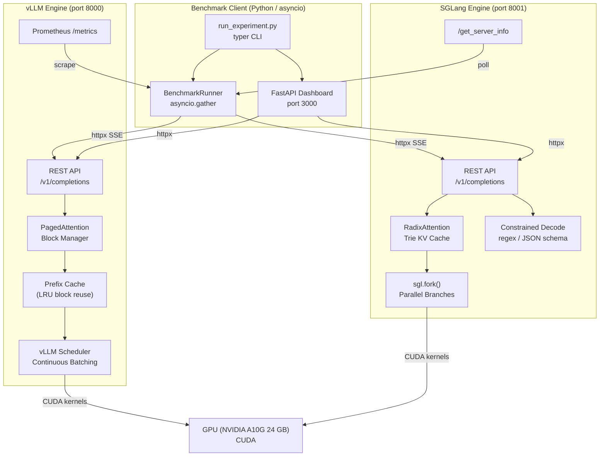

# vLLM vs SGLang — Comparative Inference Benchmark System

A production-grade benchmark harness that rigorously compares **vLLM** and **SGLang** LLM inference engines across latency, throughput, KV-cache efficiency, and structured generation speed.

## Summary

We benchmarked **13 models** (2B to 9B parameters) on a single NVIDIA A10G 24GB GPU, running **5 scenarios** across both engines — **115 total runs, 99.5%+ success rate on every run**. 10 models have both-engine results; 3 models (SmolLM3 3B, Granite 8B, DS-R1 Llama 8B) have SGLang-only results so far.

**The headline:** vLLM is the stronger general-purpose default on this hardware class. Across 50 paired comparisons (10 models x 5 scenarios), vLLM wins TTFT in **34 of 50** and throughput in **31 of 50**, with decisive advantages in structured JSON generation (10/10 wins) and prefix-sharing TTFT (9/10). SGLang stays competitive on throughput ramp and single-request decode at 7B+ scale.

| What | vLLM | SGLang |
|---|---|---|
| TTFT p95 wins (50 pairs) | **34** | 16 |
| Throughput wins (50 pairs) | **31** | 19 |
| Structured gen tok/s | **10/10** | 0/10 |
| Best single-request TTFT | **22.5 ms** (Gemma 2 2B) | 31.5 ms (Gemma 2 2B) |
| Peak throughput | **264.7 tok/s** (Gemma 2 2B) | 258.0 tok/s (Gemma 2 2B) |
| Models tested | 10 (both engines) | 13 (10 both + 3 SGLang-only) |

**Models with both engines:** Gemma 2 2B, Llama 3.2 3B, Phi-3 mini, Phi-4 mini, Qwen 2.5 7B, DS-R1 Qwen 7B, Mistral 7B, Llama 3.1 8B, Qwen3 8B, Gemma 2 9B
**SGLang-only (vLLM runs pending):** SmolLM3 3B, Granite 8B, DS-R1 Llama 8B
**Pending (0% complete):** Qwen3 30B-A3B, Gemma 3 4B, Gemma 3 12B
**Scenarios:** single-request latency, throughput ramp, long context stress, prefix sharing, structured generation
**Hardware:** AWS g5.2xlarge (NVIDIA A10G 24GB), sequential execution, one engine at a time

Full results and detailed analysis are in the [Benchmark Results](#benchmark-results) section below and in [`reports/final_benchmark_report_2026-03-31.md`](reports/final_benchmark_report_2026-03-31.md).

---

## Architecture Diagram



---

## Project Structure

```
inference-engine-benchmark-system/
├── engines/
│   ├── base_client.py          # Abstract base + GenerationResult / EngineMetrics + retry helper
│   ├── vllm_client.py          # vLLM OpenAI-compat client (SSE streaming, Prometheus metrics)
│   ├── sglang_client.py        # SGLang client (REST + native sgl.Runtime support)
│   └── py.typed                # PEP 561 type marker
│
├── benchmarks/
│   ├── metrics.py              # LatencyStats, ThroughputStats, CDF, compare_metrics
│   ├── scenarios.py            # Scenario configs + default prompt-pack mapping
│   ├── prompt_packs.py         # Prompt-pack loaders (JSONL/JSON)
│   └── runner.py               # BenchmarkRunner (asyncio.gather, metrics polling, JSON output)
│
├── sglang_programs/            # Reserved for native @sgl.function programs
│
├── dashboard/
│   └── app.py                  # FastAPI: REST API + WebSocket live metrics stream
│
├── analysis/
│   ├── report.py               # HTML report generator (matplotlib CDF/throughput/KV charts)
│   └── final_report.py         # Aggregated markdown final summary across runs
│
├── prompts/
│   ├── README.md               # Prompt-pack documentation and usage conventions
│   ├── short_chat.jsonl        # Low-latency chat prompts
│   ├── long_generation.jsonl   # Decode-heavy prompts
│   ├── long_context.jsonl      # Context-stress prompts
│   ├── structured_json.jsonl   # Schema-oriented extraction prompts
│   ├── reasoning.jsonl         # Multi-step / reasoning prompts
│   ├── shared_prefix.json      # Shared-prefix cache benchmark pack
│   └── schemas/                # JSON schemas referenced by structured prompts
│
├── tests/
│   ├── conftest.py
│   ├── test_metrics.py              # LatencyStats, ThroughputStats, CDF, compare_metrics tests
│   ├── test_base_client.py          # GenerationResult, VLLMClient, SGLangClient with respx mocks
│   ├── test_scenarios.py            # Scenario dataclasses and prompt generator tests
│   ├── test_cli.py                  # CLI commands and engine variant parsing
│   └── test_result_metadata.py      # Result filename and run_metadata correctness
│
├── results/                    # Auto-created; stores JSON result files
├── docs/
│   ├── GETTING_STARTED.md           # Onboarding guide — setup, first run, reports
│   ├── SPECULATIVE_DECODING.md      # Eagle3 + Ngram runbook and draft model reference
│   ├── ROADMAP.md                   # Next steps: quantization, multi-GPU, CI, production API
│   ├── MODEL_CATALOG.md             # 2025/2026 model catalog with GPU tier requirements
│   ├── SINGLE_GPU_OPERATION.md      # Single-GPU sequential workflow guide
│   ├── VALIDATED_BENCHMARK_RUNBOOK.md  # Validated A10G benchmark reproduction steps
│   └── KNOWN_LIMITATIONS.md         # Known issues and hardware constraints
├── run_experiment.py           # Typer CLI (run / compare / matrix / report / serve / health)
├── docker-compose.yml          # 6 engine profiles: baseline + Eagle3 + Ngram for vLLM and SGLang
├── Dockerfile.dashboard        # Lightweight dashboard container
└── pyproject.toml              # Python 3.11+ project metadata
```

---

## Quick Start

### 1. Install

```bash
pip install -e ".[dev]"
# With SGLang native programs:
pip install -e ".[sglang,dev]"
```

### 2. Prepare `.env` and model cache

```bash
cp .env.example .env
mkdir -p model-cache
```

### 3. Start one engine at a time (recommended for a single GPU)

```bash
# vLLM path
docker compose up -d dashboard vllm
curl http://localhost:8000/health

# SGLang path
docker compose up -d dashboard sglang
curl http://localhost:8001/health
```

> On a single A10G, do **not** treat `docker compose up -d` as the default benchmark path.
> The validated benchmark flow is sequential: start one engine, run benchmarks, stop it, then switch.

### 4. Check engine health

```bash
# Check both engines
python run_experiment.py health

# Check one engine explicitly
python run_experiment.py health --engines sglang
python run_experiment.py health --engines vllm

# Explicit alias for both
python run_experiment.py health --engines both
```

> In single-GPU sequential workflows, one engine may appear unreachable if it is intentionally stopped between phases.

For the exact validated A10G flow, see:
- [`docs/GETTING_STARTED.md`](docs/GETTING_STARTED.md) — full onboarding guide
- [`docs/SINGLE_GPU_OPERATION.md`](docs/SINGLE_GPU_OPERATION.md)
- [`docs/VALIDATED_BENCHMARK_RUNBOOK.md`](docs/VALIDATED_BENCHMARK_RUNBOOK.md)
- [`docs/SPECULATIVE_DECODING.md`](docs/SPECULATIVE_DECODING.md) — Eagle3 and Ngram runbook
- [`docs/ROADMAP.md`](docs/ROADMAP.md) — next steps: quantization, multi-GPU, production inference, CI
- [`docs/MODEL_CATALOG.md`](docs/MODEL_CATALOG.md) — full 2025/2026 model catalog with GPU requirements
- [`docs/KNOWN_LIMITATIONS.md`](docs/KNOWN_LIMITATIONS.md)

---

## CLI Usage

### Check version

```bash
python run_experiment.py --version
```

### Run a single scenario

```bash
# Single engine
python run_experiment.py run --scenario single_request_latency --engines vllm

# Both engines (best for multi-host or non-constrained setups)
python run_experiment.py run --scenario throughput_ramp --engines vllm,sglang

# Strict mode: abort if engine health check fails (recommended for CI/production)
python run_experiment.py run --scenario single_request_latency --engines vllm --strict

# Custom model + prompt pack
python run_experiment.py run \
  --scenario prefix_sharing_benefit \
  --engines vllm,sglang \
  --model Qwen/Qwen2.5-7B-Instruct \
  --prompt-pack shared_prefix
```

> On a single GPU host, prefer one engine at a time even if the CLI supports a comma-separated engine list.

### Compare both engines head-to-head

```bash
python run_experiment.py compare \
  --scenario structured_generation_speed \
  --prompt-pack structured_json
```

### Run a sequential matrix (scenario × engine × iteration)

```bash
python run_experiment.py matrix \
  --model Qwen/Qwen2.5-7B-Instruct \
  --scenarios single_request_latency,throughput_ramp \
  --engines sglang,vllm \
  --iterations 2 \
  --cooldown-seconds 300
```

### Generate reports

```bash
# Existing visual HTML report
python run_experiment.py report --output report.html

# Restrict the HTML report to one model when a results directory has mixed models
python run_experiment.py report --results-dir results --model Qwen/Qwen2.5-7B-Instruct --output report_qwen.html

# Aggregated markdown summary
python run_experiment.py final-report --output final_report.md

# Restrict the markdown summary to one model too
python run_experiment.py final-report --results-dir results --model Qwen/Qwen2.5-7B-Instruct --output final_report_qwen.md
```

### Start the dashboard

```bash
python run_experiment.py serve
# Open http://localhost:3000 (binds to 127.0.0.1 by default)
# Optional model pin: http://localhost:3000/?model=Qwen/Qwen2.5-7B-Instruct

# Point the dashboard at a specific results directory:
python run_experiment.py serve --results-dir results_validation

# To expose on all interfaces (e.g. in Docker or remote access):
python run_experiment.py serve --host 0.0.0.0 --results-dir results_validation
```

### List scenarios and prompt packs

```bash
python run_experiment.py list-scenarios
python run_experiment.py list-prompt-packs
```

---

## Benchmark Scenarios

| Scenario | Requests | Concurrency | Focus |
|---|---|---|---|
| `single_request_latency` | 50 | 1 | P50/P95/P99 TTFT, pure engine overhead |
| `throughput_ramp` | 100x7 levels | 1 to 64 | Max tokens/sec, saturation point |
| `long_context_stress` | 20 | 4 | 4096-token prompts, GPU memory pressure |
| `prefix_sharing_benefit` | 100 | 8 | 512-tok shared prefix, cache warm-up curve |
| `structured_generation_speed` | 200 | 16 | JSON extraction, constrained decode |

## Prompt Packs

The repo now includes a starter prompt corpus under `prompts/` so benchmark runs can cover more than one workload style.

Included packs:
- `short_chat.jsonl` — short prompts + short outputs for TTFT-focused testing
- `long_generation.jsonl` — short prompts requesting long outputs for decode-heavy testing
- `long_context.jsonl` — document/transcript-style prompts for context-stress evaluation
- `structured_json.jsonl` — extraction/classification prompts with schema references
- `reasoning.jsonl` — multi-step technical prompts for longer analytic responses
- `shared_prefix.json` — shared system/context prefix with variable suffixes for cache-reuse testing

This structure is intended to make benchmark conclusions more representative than repeatedly hammering a single prompt pattern.

Default scenario→pack mapping is automatic (unless overridden with `--prompt-pack`):
- `single_request_latency` → `short_chat`
- `throughput_ramp` → `long_generation`
- `long_context_stress` → `long_context`
- `prefix_sharing_benefit` → `shared_prefix`
- `structured_generation_speed` → `structured_json`

---

## Speculative Decoding

Speculative decoding is an **engine startup configuration**, not a separate scenario. The same 5 scenarios run against 6 engine variants — baseline, Eagle3, and Ngram — so you get an apples-to-apples speedup measurement.

| Variant | Engine | Method | Draft model needed | Expected TTFT speedup |
|---|---|---|---|---|
| `vllm` | vLLM | — (baseline) | No | — |
| `vllm-eagle3` | vLLM | Eagle3 | Yes (~1–2 GB) | 1.8–2.4× |
| `vllm-ngram` | vLLM | Ngram | No | 1.2–1.5× |
| `sglang` | SGLang | — (baseline) | No | — |
| `sglang-eagle3` | SGLang | Eagle3 | Yes (~1–2 GB) | 1.8–2.4× |
| `sglang-ngram` | SGLang | Ngram | No | 1.2–1.5× |

> Speedup figures are for single-request workloads on A10G. Performance degrades at concurrency > 16 as the GPU becomes compute-saturated.

**Quick start (Eagle3, Llama 3.1 8B, vLLM):**

```bash
export MODEL=meta-llama/Llama-3.1-8B-Instruct

# Baseline
docker compose --profile vllm up -d vllm && sleep 120
python run_experiment.py run -s single_request_latency -e vllm --model $MODEL
docker compose --profile vllm down

# Eagle3 — loads two models, needs ~180s
docker compose --profile vllm-eagle3 up -d vllm-eagle3 && sleep 180
python run_experiment.py run -s single_request_latency -e vllm-eagle3 --model $MODEL
docker compose --profile vllm-eagle3 down

# Ngram — no draft model
docker compose --profile vllm-ngram up -d vllm-ngram && sleep 120
python run_experiment.py run -s single_request_latency -e vllm-ngram --model $MODEL
docker compose --profile vllm-ngram down

# All three variants feed into the same report
python run_experiment.py final-report --model $MODEL --output spec_dec_summary.md
```

Full runbook, draft model reference table, and SGLang instructions: [`docs/SPECULATIVE_DECODING.md`](docs/SPECULATIVE_DECODING.md)

---

## Models — 2025/2026

### A10G 24GB (benchmarkable today)

| Model | HF ID | VRAM | Spec-dec | Token needed |
|---|---|---|---|---|
| **Qwen3-8B** (default) | `Qwen/Qwen3-8B` | ~16 GB | Eagle3 + Ngram (vLLM), Ngram (SGLang) | No |
| Llama 3.1 8B | `meta-llama/Llama-3.1-8B-Instruct` | ~16 GB | Eagle3 + Ngram, both engines | Yes |
| Gemma 3 4B | `google/gemma-3-4b-it` | ~8 GB | Ngram only | Yes |
| DeepSeek-R1 Distill 7B | `deepseek-ai/DeepSeek-R1-Distill-Qwen-7B` | ~14 GB | Ngram only | No |
| Llama 3.2 3B | `meta-llama/Llama-3.2-3B-Instruct` | ~6 GB | Ngram | Yes |

> For Eagle3 on 8B models, set `gpu-memory-utilization=0.80` (vLLM) or `mem-fraction-static=0.70` (SGLang) to leave headroom for the draft model.

### A100/H100 (larger hardware)

| Model | HF ID | Min GPU | Notes |
|---|---|---|---|
| Mistral Small 3.2 24B | `mistralai/Mistral-Small-3.2-24B-Instruct-2506` | A100 40GB | Strong multilingual |
| Qwen3 32B | `Qwen/Qwen3-32B` | A100 80GB | Top open-weight at 32B |
| Llama 3.3 70B | `meta-llama/Llama-3.3-70B-Instruct` | 2× A100 80GB | Full Eagle3 draft support |

---

## Getting Started

New to the system? Start here: [`docs/GETTING_STARTED.md`](docs/GETTING_STARTED.md)

Covers: environment setup → first benchmark run → speculative decoding → report generation → direct inference API.

---

## Dashboard API

| Method | Endpoint | Description |
|---|---|---|
| `GET` | `/` | Browser-friendly dashboard home |
| `GET` | `/api/results` | List saved result files (`?model=...` optional) |
| `GET` | `/api/results/{id}` | Load a specific result |
| `GET` | `/api/current` | Detect the currently running benchmark/test + active services (`?model=...` filters result summaries) |
| `GET` | `/api/compare/{scenario}` | Model-consistent vLLM+SGLang delta for a scenario (`?model=...` optional) |
| `POST` | `/api/run` | Start a background benchmark run |
| `GET` | `/api/run/{job_id}/status` | Poll run progress |
| `WS` | `/ws/live` | Real-time metric stream (JSON messages) |

CLI note: `python run_experiment.py serve --results-dir <dir>` sets the dashboard source directory without manually exporting `RESULTS_DIR`.

**POST /api/run payload:**
```json
{
  "scenario": "throughput_ramp",
  "engines": ["vllm", "sglang"],
  "model": "Qwen/Qwen2.5-1.5B-Instruct"
}
```

**WebSocket message types:**
```
{"type": "heartbeat", "ts": 1234567890}
{"type": "progress", "data": {"done": 42, "total": 100, "last_ttft_ms": 38.2}}
{"type": "metrics",  "data": {"engine": "vllm", "ttft_p95": 72.4, "tokens_per_sec": 1243}}
{"type": "done",     "data": {"job_id": "...", "result_paths": [...]}}
```

---

## Running Tests

```bash
# All tests (no live engines needed; uses httpx mocking via respx)
pytest tests/ -v

# Specific test files
pytest tests/test_metrics.py tests/test_base_client.py -v

# With coverage
pytest tests/ --cov=engines --cov=benchmarks --cov-report=term-missing
```

---

## Architecture Deep-Dive

### vLLM — PagedAttention

- KV cache split into fixed-size **pages** (blocks), managed by a block allocator
- **Prefix cache**: LRU reuse of blocks for repeated prompt prefixes
- **Continuous batching**: adds/removes requests mid-batch for high utilisation
- Metrics exposed via Prometheus at `/metrics`
- SSE streaming at `/v1/completions` (OpenAI-compat)

### SGLang — RadixAttention

- KV cache stored as a **radix tree** (trie) keyed on token sequences
- All in-flight requests share the trie — automatic prefix deduplication
- `sgl.fork()` creates parallel decode branches sharing the same KV prefix
- **Constrained decode** built-in: regex / JSON schema enforces valid tokens
- Metrics via `/get_server_info` JSON endpoint

### Key Benchmark Insights

1. **Prefix sharing**: Both engines support KV cache reuse for shared prefixes. In this benchmark, vLLM won TTFT on all 7 models and throughput on 5 of 7 in the prefix-sharing scenario
2. **Parallel programs**: `sgl.fork()` runs N branches in one batch vs N sequential HTTP calls — theoretically faster on multi-hypothesis workloads (not tested in this benchmark)
3. **Constrained decode**: SGLang's native regex constraint enforces valid tokens at decode time, reducing JSON parse failures in principle (not directly measured in this benchmark)
4. **Throughput at high concurrency**: vLLM's continuous batching is highly competitive at concurrency >= 16

---

## Configuration

| Environment Variable | Default | Description |
|---|---|---|
| `HUGGING_FACE_HUB_TOKEN` | — | HF token for gated models |
| `VLLM_HOST` | `localhost` | vLLM server host |
| `VLLM_PORT` | `8000` | vLLM server port |
| `SGLANG_HOST` | `localhost` | SGLang server host |
| `SGLANG_PORT` | `8001` | SGLang server port |
| `RESULTS_DIR` | `results/` | Directory for JSON result files |
| `ALLOWED_ORIGINS` | `http://localhost:3000` | Comma-separated CORS origins for the dashboard |
| `LOG_FORMAT` | `console` | Logging output format: `console` (colored) or `json` (structured) |
| `LOG_LEVEL` | `INFO` | Logging level: `DEBUG`, `INFO`, `WARNING`, `ERROR` |

---

## Requirements

- Python 3.11+
- NVIDIA GPU with >= 24 GB VRAM (A10G validated; A100/H100 also supported)
- Docker + NVIDIA Container Toolkit (for `docker compose`)
- `pip install -e ".[dev]"` for local development

---

## AWS Deployment

Two deployment tools are provided — a **self-contained bash script** (no extra tools needed) and a **Terraform module** for team/repeatable workflows.

### Option 1 — Bash Script (Quickest, No Terraform Required)

`deploy/ec2_deploy.sh` handles everything end-to-end with only the **AWS CLI** and standard unix tools (`jq`, `ssh`, `scp`/`rsync`). It creates all networking, launches instances, uploads the project, starts Docker Compose, and polls until engines are healthy.

**Prerequisites:**

```bash
# AWS CLI v2 (https://docs.aws.amazon.com/cli/latest/userguide/install-cliv2.html)
aws configure          # set Access Key, Secret, region
aws sts get-caller-identity   # verify

# jq (https://jqlang.github.io/jq/)
brew install jq        # macOS
sudo apt install jq    # Ubuntu/Debian
```

**Single GPU instance** (~$1.21/hr — both engines share one A10G):

```bash
./deploy/ec2_deploy.sh \
  --mode   single \
  --key    my-key-pair \
  --region us-east-1
  # prompts for HuggingFace token; everything else has sensible defaults
```

**Two dedicated GPU instances** (~$2.46/hr — one engine per GPU):

```bash
./deploy/ec2_deploy.sh \
  --mode     multi \
  --key      my-key-pair \
  --hf-token hf_YOUR_TOKEN \
  --region   us-east-1
```

**All flags:**

```
--mode       single|multi              Topology (default: single)
--region     AWS region                (default: us-east-1)
--instance   EC2 instance type         (default: g5.2xlarge)
--key        EC2 key pair name         (required)
--hf-token   HuggingFace Hub token     (default: empty)
--model      HF model ID               (default: Qwen/Qwen2.5-1.5B-Instruct)
--volume-gb  Root EBS size in GB       (default: 100)
--project    Resource name prefix      (default: llm-benchmark)
--state-file Path to state JSON        (default: .ec2_state.json)
--yes        Auto-confirm all prompts  (non-interactive)
```

The script saves all created resource IDs to `.ec2_state.json`. Use this to tear down:

```bash
./deploy/ec2_deploy.sh --destroy
# Terminates instances, releases EIPs, deletes VPC/SGs
```

After deploy, the script prints:

```
══════════════════════════════════════
  Deployment Complete
══════════════════════════════════════

  single           54.x.x.x

Dashboard: http://54.x.x.x:3000

SSH commands:
  single           ssh -i ~/.ssh/my-key.pem ubuntu@54.x.x.x

Run benchmarks (from the instance):
  ~/run_benchmark.sh                    # all scenarios + HTML report
  python run_experiment.py health

Copy HTML report to laptop:
  scp -i ~/.ssh/my-key.pem ubuntu@54.x.x.x:~/report.html ./report.html
```

---

### Option 2 — Terraform (Repeatable / Team Workflows)

Full Terraform module under `deploy/terraform/`. Manages the same two topologies with remote state, variable files, and lifecycle rules. See the full walkthrough below.

Two topology options are provided, both managed by Terraform under `deploy/terraform/`.

### Instance Options

| Option | Instances | Cost (us-east-1, on-demand) | Best for |
|---|---|---|---|
| **A — Single** | 1× g5.2xlarge (1× A10G 24 GB) | ~$1.21/hr | Dev, cost-sensitive benchmarks |
| **B — Multi** | 2× g5.2xlarge + 1× t3.medium | ~$2.46/hr | Fair isolation benchmarks |

> **Tip:** Use Spot instances for up to 70% savings. Add `instance_market_options` to the `aws_instance` blocks or switch to an ASG.

---

### Prerequisites

| Tool | Install |
|---|---|
| AWS CLI v2 | [docs.aws.amazon.com/cli](https://docs.aws.amazon.com/cli/latest/userguide/install-cliv2.html) |
| Terraform ≥ 1.5 | [developer.hashicorp.com/terraform](https://developer.hashicorp.com/terraform/downloads) |
| An EC2 Key Pair | AWS Console → EC2 → Key Pairs → Create |
| Your public IP | `curl -s https://checkip.amazonaws.com` |

### AWS quota requisition (important before deploy)

GPU instances are commonly quota-blocked in new AWS accounts. Before running deployment, request quota increases in **Service Quotas** for your target region.

Recommended requests:

- **EC2 On-Demand G and VT instances** (for `g5.*`)
- If using Spot: **EC2 Spot Instance Requests for G and VT instances**
- Optional fallback if you plan alternatives: quotas for `g4dn.*` / `p*` families

Suggested initial values:

- Option A (single `g5.2xlarge`): request enough for **1 instance**
- Option B (multi): request enough for **2x g5.2xlarge + 1x t3.medium**

If quota is insufficient, Terraform/script deploy will fail with capacity/quota errors even when config is correct.

```bash
aws configure          # set Access Key, Secret, region (us-east-1)
aws sts get-caller-identity   # verify credentials
```

---

### Option A — Single GPU Instance

Both engines + dashboard on **one** g5.2xlarge. Engines share the GPU and run **sequentially** (start one, benchmark, stop, start the other). Cheapest option.

```
VPC 10.42.0.0/16
  └─ Public subnet
       └─ g5.2xlarge  [Elastic IP]
            ├─ vLLM    → :8000  (internal only)
            ├─ SGLang  → :8001  (internal only)
            └─ Dashboard → :3000  (your IP only)
```

**Deploy:**

```bash
cd deploy/terraform

# 1. Initialise providers
terraform init

# 2. Preview the plan
terraform plan \
  -var="key_pair_name=my-key" \
  -var="your_ip_cidr=$(curl -s https://checkip.amazonaws.com)/32" \
  -var="hf_token=hf_YOUR_TOKEN" \
  -var="deployment_mode=single"

# 3. Apply (creates VPC, SGs, EIP, EC2 — takes ~3 min)
terraform apply \
  -var="key_pair_name=my-key" \
  -var="your_ip_cidr=$(curl -s https://checkip.amazonaws.com)/32" \
  -var="hf_token=hf_YOUR_TOKEN" \
  -var="deployment_mode=single"
```

Terraform prints the connection details:

```
Outputs:

dashboard_url    = "http://54.x.x.x:3000"
ssh_commands     = { single = "ssh -i ~/.ssh/my-key.pem ubuntu@54.x.x.x" }
benchmark_commands = {
  health       = "python run_experiment.py health --vllm-host localhost ..."
  run_latency  = "python run_experiment.py run --scenario single_request_latency ..."
  compare      = "python run_experiment.py compare --scenario prefix_sharing_benefit ..."
}
cost_reminder    = "~$1.21/hr (1× g5.2xlarge). Stop the instance when idle."
```

---

### Option B — Dedicated GPU Per Engine (Recommended for Fair Benchmarks)

Each engine gets its own GPU instance with zero resource contention. A third CPU-only instance runs the dashboard and CLI.

```
VPC 10.42.0.0/16
  └─ Public subnet
       ├─ g5.2xlarge  vllm-host    [Elastic IP]  :8000
       ├─ g5.2xlarge  sglang-host  [Elastic IP]  :8001
       └─ t3.medium   dashboard    [Elastic IP]  :3000
```

**Deploy:**

```bash
cd deploy/terraform

terraform apply \
  -var="key_pair_name=my-key" \
  -var="your_ip_cidr=$(curl -s https://checkip.amazonaws.com)/32" \
  -var="hf_token=hf_YOUR_TOKEN" \
  -var="deployment_mode=multi"
```

The dashboard instance is automatically configured with the private IPs of the engine nodes — no manual wiring needed.

---

### Post-Deploy: Run Benchmarks

Wait ~5-10 minutes for Docker images to pull and models to download (~4 GB).

```bash
# SSH into the single instance (Option A) or dashboard (Option B)
ssh -i ~/.ssh/my-key.pem ubuntu@<IP from terraform output>

# Check both engines are healthy
python run_experiment.py health

# Run all scenarios and generate report (uses ~/run_benchmark.sh shortcut)
~/run_benchmark.sh

# Or run individual scenarios
python run_experiment.py run \
  --scenario throughput_ramp \
  --engines vllm,sglang

# Generate HTML report
python run_experiment.py report --output ~/report.html

# Copy report to your laptop
# (run this on your laptop, not the instance)
scp -i ~/.ssh/my-key.pem ubuntu@<IP>:~/report.html ./report.html
```

Monitor engine startup logs:

```bash
# On the GPU instance
docker compose logs -f vllm     # vLLM model loading
docker compose logs -f sglang   # SGLang model loading

# Full bootstrap log (if troubleshooting)
sudo cat /var/log/benchmark-setup.log
```

---

### Switching Models

To benchmark a larger model, override the `model_id` variable:

```bash
terraform apply \
  -var="model_id=Qwen/Qwen2.5-7B-Instruct" \
  -var="instance_type_gpu=g5.12xlarge" \
  -var="volume_size_gb=200" \
  ...
```

**GPU VRAM requirements:**

| Model | Min VRAM | Recommended instance | AWS vCPUs |
|---|---|---|---:|
| Qwen2.5-1.5B | 4 GB | g4dn.xlarge (T4 16 GB) | 4 |
| Qwen2.5-7B | 16 GB | g5.2xlarge (A10G 24 GB) | 8 |
| Qwen2.5-14B | 30 GB | g5.12xlarge (4× A10G 96 GB) | 48 |
| Llama 3.1 8B | 18 GB | g5.2xlarge (A10G 24 GB) | 8 |
| Llama 3.1 70B | 140 GB | p4d.24xlarge (8× A100 320 GB) | 96 |

**Storage planning (disk) for multi-model benchmarking:**

- Keep at least **50–70 GB free disk** before large benchmark batches.
- Typical model cache growth (approximate):
  - **2B class** models: ~4–8 GB each
  - **7B–9B class** models: ~10–20 GB each
  - **14B+ class** models: ~25–45 GB each
- Docker image layers for inference engines can consume **20–60 GB** over time.
- Sequential benchmarking (one engine/model active at a time) reduces peak storage churn and avoids duplicate temporary artifacts.
- If disk pressure appears, prune stopped/unused Docker images between batches (`docker image prune -a`) and keep only active model caches.

---

### Using a terraform.tfvars File

Avoid typing variables on every command:

```bash
# deploy/terraform/terraform.tfvars  (gitignored — never commit secrets)
aws_region       = "us-west-2"
deployment_mode  = "multi"
key_pair_name    = "my-key"
your_ip_cidr     = "1.2.3.4/32"
hf_token         = "hf_YOUR_TOKEN"
model_id         = "Qwen/Qwen2.5-1.5B-Instruct"
instance_type_gpu = "g5.2xlarge"
volume_size_gb   = 100
```

Then just run:

```bash
terraform plan
terraform apply
```

---

### Saving State Remotely (Team Collaboration)

Add an S3 backend so multiple team members share Terraform state:

```hcl
# deploy/terraform/backend.tf  (create this file)
terraform {
  backend "s3" {
    bucket         = "your-terraform-state-bucket"
    key            = "llm-benchmark/terraform.tfstate"
    region         = "us-east-1"
    encrypt        = true
    dynamodb_table = "terraform-locks"
  }
}
```

```bash
# Create the S3 bucket and DynamoDB table once
aws s3api create-bucket --bucket your-terraform-state-bucket --region us-east-1
aws dynamodb create-table \
  --table-name terraform-locks \
  --attribute-definitions AttributeName=LockID,AttributeType=S \
  --key-schema AttributeName=LockID,KeyType=HASH \
  --billing-mode PAY_PER_REQUEST

terraform init   # migrates local state to S3
```

---

### Cost Optimisation

**Stop (not terminate) when idle:**

```bash
# Stop instances to pause billing for compute (EBS and EIP still billed)
aws ec2 stop-instances --instance-ids $(terraform output -json instance_ids | jq -r '.[]')

# Restart later
aws ec2 start-instances --instance-ids $(terraform output -json instance_ids | jq -r '.[]')
```

**Auto-stop guardrails for idle GPU spend (recommended):**

Use one (or both) of these patterns so GPU instances do not run overnight unintentionally.

1. **Cron/script-based auto-stop (simple):**
   - Run a scheduled script (e.g., every 30-60 min) that checks whether benchmark containers/jobs are active.
   - If no active benchmark process is found for a safe window (e.g., 60+ min), stop the GPU instance.

2. **CloudWatch alarm + action (managed):**
   - Create a CloudWatch alarm on low `GPUUtilization` (or fallback CPU/network inactivity signals).
   - Trigger an automation action (Lambda/SSM) to stop the EC2 instance after sustained idle time.

Example minimal auto-stop script (run on the GPU host):

```bash
#!/usr/bin/env bash
set -euo pipefail

# If no benchmark process and no running containers, stop instance.
if ! pgrep -f "run_experiment.py run" >/dev/null 2>&1; then
  if [ -z "$(sudo docker ps -q)" ]; then
    INSTANCE_ID=$(curl -s http://169.254.169.254/latest/meta-data/instance-id)
    REGION=$(curl -s http://169.254.169.254/latest/dynamic/instance-identity/document | jq -r .region)
    aws ec2 stop-instances --region "$REGION" --instance-ids "$INSTANCE_ID"
  fi
fi
```

> Tip: keep a manual override flag (e.g., `/tmp/no-autostop`) to prevent shutdown during debugging sessions.

**Use Spot Instances** for up to 70% savings — safe for benchmarking since runs are short:

```bash
terraform apply -var="use_spot=true" ...
# (requires adding spot instance configuration to main.tf)
```

**Typical monthly cost reference (us-east-1, 8 hrs/day × 22 days):**

| Mode | Instance(s) | Monthly est. |
|---|---|---|
| Single | 1× g5.2xlarge | ~$213 |
| Multi | 2× g5.2xlarge + 1× t3.medium | ~$435 |
| Single Spot | 1× g5.2xlarge (spot) | ~$64–$100 |

---

### Teardown

```bash
# Destroy all AWS resources (VPC, SGs, EC2, EIP)
cd deploy/terraform
terraform destroy \
  -var="key_pair_name=my-key" \
  -var="your_ip_cidr=$(curl -s https://checkip.amazonaws.com)/32"

# Confirm with "yes" when prompted
```

> All resources are tagged with `Project = llm-benchmark` so you can audit them in the AWS Console under **Resource Groups & Tag Editor** before destroying.

---

### Troubleshooting

| Symptom | Fix |
|---|---|
| SSH connection refused | Check `your_ip_cidr` matches your current IP. Re-run `terraform apply` with updated value. |
| `curl localhost:8000/health` hangs | Model still downloading. Wait and check `docker compose logs -f vllm`. |
| GPU not visible in Docker | Run `nvidia-smi` on the instance. If it fails, reboot: `sudo reboot`. |
| Out of GPU memory | Reduce `--gpu-memory-utilization` in `docker-compose.yml` or upgrade instance type. |
| Bootstrap failed | Check `/var/log/benchmark-setup.log` on the instance. |
| Dashboard 502 / not reachable | Check security group has port 3000 open for your IP. Verify `systemctl status benchmark-dashboard`. |

---

## Benchmark Results

**115 benchmark runs** across 13 models (2B to 9B), 5 scenarios, and 2 inference engines on a single NVIDIA A10G 24GB (AWS g5.2xlarge). All runs executed sequentially — one engine at a time — to avoid GPU memory contention. 10 models have both-engine data; 3 have SGLang-only results pending vLLM re-runs.

### Visual Summary

#### Single-request latency (TTFT p95)


#### Throughput tokens/sec


#### Throughput requests/sec


#### Throughput tradeoff map


### Key Findings

- **vLLM wins TTFT p95 in 34 of 50 paired comparisons** (10 models x 5 scenarios). The gap is largest on small models (Gemma 2 2B: 22.5 ms vs 31.5 ms) and narrows at 7B+ scale.
- **vLLM wins throughput (tok/s) in 31 of 50 paired comparisons**, with the strongest edge in structured generation (10/10 wins) and prefix sharing (8/10).
- **SGLang wins throughput ramp TTFT on 6/10 models** — it handles concurrent load better at larger model sizes.
- **SGLang wins single-request decode throughput on 7/10 models** — marginally faster raw decode speed, though vLLM wins on TTFT.
- **Phi-4 mini** (new model) performs comparably to Phi-3 mini, with vLLM leading TTFT and SGLang competitive on throughput.
- **Gemma 2 9B + SGLang throughput_ramp remains anomalous** — 26s TTFT p95 indicates severe VRAM pressure at high concurrency.
- **99.5%+ success rate** on every completed run.

### Models Tested

| Model | Params | vLLM | SGLang | Status | Notes |
|---|---:|---|---|---|---|
| `google/gemma-2-2b-it` | 2B | 10 | 10 | Complete | Fastest overall |
| `HuggingFaceTB/SmolLM3-3B` | 3B | -- | 5 | SGLang only | vLLM pending |
| `meta-llama/Llama-3.2-3B-Instruct` | 3B | 10 | 10 | Complete | |
| `microsoft/Phi-3-mini-4k-instruct` | 3.8B | 10 | 10 | Complete | |
| `microsoft/Phi-4-mini-instruct` | 3.8B | 5 | 5 | Complete | New model |
| `Qwen/Qwen2.5-7B-Instruct` | 7B | 10 | 10 | Complete | |
| `deepseek-ai/DeepSeek-R1-Distill-Qwen-7B` | 7B | 5 | 5 | Complete | Reasoning-tuned |
| `mistralai/Mistral-7B-Instruct-v0.3` | 7B | 10 | 10 | Complete | |
| `meta-llama/Llama-3.1-8B-Instruct` | 8B | 10 | 10 | Complete | |
| `Qwen/Qwen3-8B` | 8B | 5 | 5 | Complete | |
| `ibm-granite/granite-3.3-8b-instruct` | 8B | -- | 5 | SGLang only | vLLM pending |
| `deepseek-ai/DeepSeek-R1-Distill-Llama-8B` | 8B | -- | 5 | SGLang only | vLLM pending |
| `google/gemma-2-9b-it` | 9B | 10 | 10 | Complete | Tuned vLLM fit |

**Pending models (not yet started):** Qwen3 30B-A3B (MoE), Gemma 3 4B, Gemma 3 12B

### Engine Head-to-Head (10 models with both engines)

| Scenario | TTFT p95 Winner | Tok/s Winner |
|---|---|---|
| `single_request_latency` | **vLLM** (9 of 10) | SGLang (7 of 10) |
| `throughput_ramp` | SGLang (6 of 10) | SGLang (6 of 10) |
| `long_context_stress` | Tied (5 / 5) | **vLLM** (6 of 10) |
| `prefix_sharing_benefit` | **vLLM** (9 of 10) | **vLLM** (8 of 10) |
| `structured_generation_speed` | **vLLM** (7 of 10) | **vLLM** (10 of 10) |

### Single Request Latency (all 13 models)

| Model | Engine | TTFT p95 | Latency p95 | Tok/s | Req/s | Success |
|---|---|---:|---:|---:|---:|---:|
| Gemma 2 2B | vLLM | **22.5 ms** | 1655.6 ms | 77.6 | 0.75 | 100% |
| Gemma 2 2B | SGLang | 31.5 ms | 1656.1 ms | 78.2 | 0.75 | 100% |
| SmolLM3 3B | SGLang | 59.8 ms | 2052.8 ms | 62.1 | 0.49 | 100% |
| Llama 3.2 3B | vLLM | **23.3 ms** | 1928.7 ms | 66.3 | 0.52 | 100% |
| Llama 3.2 3B | SGLang | 33.2 ms | 1903.4 ms | 67.7 | 0.53 | 100% |
| Phi-3 mini | vLLM | **25.3 ms** | 2233.8 ms | **57.8** | 0.45 | 100% |
| Phi-3 mini | SGLang | 50.5 ms | 2319.8 ms | 55.7 | 0.44 | 100% |
| Phi-4 mini | vLLM | **33.4 ms** | 2269.0 ms | **56.8** | 0.55 | 100% |
| Phi-4 mini | SGLang | 39.9 ms | 2411.7 ms | 52.7 | 0.53 | 100% |
| Qwen 2.5 7B | vLLM | **62.7 ms** | 4220.3 ms | 30.6 | 0.29 | 100% |
| Qwen 2.5 7B | SGLang | 65.7 ms | 4170.2 ms | 30.9 | 0.27 | 100% |
| DS-R1 Qwen 7B | vLLM | **62.8 ms** | 4215.8 ms | 30.5 | 0.28 | 100% |
| DS-R1 Qwen 7B | SGLang | 66.3 ms | 4177.2 ms | 30.9 | 0.24 | 100% |
| Mistral 7B | vLLM | **62.5 ms** | 4064.0 ms | 31.8 | 0.26 | 100% |
| Mistral 7B | SGLang | 62.7 ms | 4047.0 ms | 31.8 | 0.26 | 100% |
| Llama 3.1 8B | vLLM | **43.8 ms** | 4247.3 ms | 30.3 | 0.24 | 100% |
| Llama 3.1 8B | SGLang | 67.0 ms | 4247.2 ms | 30.3 | 0.24 | 100% |
| Qwen3 8B | vLLM | **44.6 ms** | 4377.4 ms | 29.5 | 0.23 | 100% |
| Qwen3 8B | SGLang | 71.4 ms | 4382.9 ms | 29.2 | 0.23 | 100% |
| Granite 8B | SGLang | 76.4 ms | 4646.1 ms | 27.6 | 0.22 | 100% |
| DS-R1 Llama 8B | SGLang | 68.9 ms | 4253.0 ms | 30.3 | 0.24 | 100% |
| Gemma 2 9B | vLLM | 105.8 ms | 5360.3 ms | 24.0 | 0.21 | 100% |
| Gemma 2 9B | SGLang | **83.4 ms** | 5312.4 ms | 24.1 | 0.21 | 100% |

### Throughput Ramp (700 requests across 7 concurrency levels)

| Model | Engine | TTFT p95 | Latency p95 | Tok/s | Req/s | Success |
|---|---|---:|---:|---:|---:|---:|
| Gemma 2 2B | vLLM | **135.5 ms** | **4588.2 ms** | **264.7** | **1.14** | 100% |
| Gemma 2 2B | SGLang | 156.1 ms | 4844.5 ms | 258.0 | 1.05 | 100% |
| SmolLM3 3B | SGLang | 371.9 ms | 10724.5 ms | 204.6 | 0.80 | 100% |
| Llama 3.2 3B | vLLM | 174.9 ms | **5415.8 ms** | 223.5 | 0.87 | 100% |
| Llama 3.2 3B | SGLang | **159.5 ms** | 5544.7 ms | **226.0** | **0.88** | 100% |
| Phi-3 mini | vLLM | 228.9 ms | 8063.6 ms | **190.9** | **0.75** | 100% |
| Phi-3 mini | SGLang | **167.3 ms** | **7538.7 ms** | 187.2 | 0.73 | 100% |
| Phi-4 mini | vLLM | **153.1 ms** | **7511.6 ms** | **188.6** | 0.74 | 100% |
| Phi-4 mini | SGLang | 160.9 ms | 8410.8 ms | 175.9 | **0.79** | 100% |
| Qwen 2.5 7B | vLLM | 196.5 ms | 9772.7 ms | 105.3 | 0.41 | 100% |
| Qwen 2.5 7B | SGLang | **175.1 ms** | **9542.9 ms** | **106.3** | **0.42** | 100% |
| DS-R1 Qwen 7B | vLLM | **184.7 ms** | **9322.1 ms** | 105.6 | 0.41 | 100% |
| DS-R1 Qwen 7B | SGLang | 313.3 ms | 9603.0 ms | **106.1** | 0.41 | 100% |
| Mistral 7B | vLLM | 209.8 ms | 10139.1 ms | 106.6 | 0.42 | 100% |
| Mistral 7B | SGLang | **179.3 ms** | **10122.3 ms** | **106.8** | 0.42 | 99.9% |
| Llama 3.1 8B | vLLM | 195.6 ms | **10523.5 ms** | 101.7 | 0.40 | 100% |
| Llama 3.1 8B | SGLang | **183.0 ms** | 10617.4 ms | **102.1** | 0.40 | 100% |
| Qwen3 8B | vLLM | 203.7 ms | **11529.1 ms** | 98.4 | 0.38 | 100% |
| Qwen3 8B | SGLang | **199.3 ms** | 11749.9 ms | **98.6** | **0.39** | 100% |
| Granite 8B | SGLang | 199.1 ms | 12471.4 ms | 92.8 | 0.36 | 100% |
| DS-R1 Llama 8B | SGLang | 177.8 ms | 10611.2 ms | 102.0 | 0.40 | 100% |
| Gemma 2 9B | vLLM | **280.3 ms** | **14399.0 ms** | **79.8** | **0.33** | 100% |
| Gemma 2 9B | SGLang | 25982.1 ms | 46027.4 ms | 77.5 | 0.30 | 99.7% |

### Model Size vs Performance

How key metrics scale as model size increases (best available engine, single request latency):

| Model | Params | TTFT p95 | Tok/s | Latency p95 |
|---|---:|---:|---:|---:|
| Gemma 2 2B | 2B | 22.5 ms | 78.2 | 1655.6 ms |
| SmolLM3 3B | 3B | 59.8 ms | 62.1 | 2052.8 ms |
| Llama 3.2 3B | 3B | 23.3 ms | 67.7 | 1903.4 ms |
| Phi-3 mini | 3.8B | 25.3 ms | 57.8 | 2233.8 ms |
| Phi-4 mini | 3.8B | 33.4 ms | 56.8 | 2269.0 ms |
| Qwen 2.5 7B | 7B | 62.7 ms | 30.9 | 4170.2 ms |
| DS-R1 Qwen 7B | 7B | 62.8 ms | 30.9 | 4177.2 ms |
| Mistral 7B | 7B | 62.5 ms | 31.8 | 4047.0 ms |
| Llama 3.1 8B | 8B | 43.8 ms | 30.3 | 4247.2 ms |
| Qwen3 8B | 8B | 44.6 ms | 29.5 | 4377.4 ms |
| Granite 8B | 8B | 76.4 ms | 27.6 | 4646.1 ms |
| DS-R1 Llama 8B | 8B | 68.9 ms | 30.3 | 4253.0 ms |
| Gemma 2 9B | 9B | 83.4 ms | 24.1 | 5312.4 ms |

TTFT grows ~4x from 2B to 9B. Throughput drops ~3x. The steepest jump is from 3.8B to 7B, where VRAM pressure begins on a 24GB GPU.

### Notable Anomalies

- **Gemma 2 9B + SGLang throughput_ramp**: 26s TTFT p95 and 46s tail latency. At 9.2B parameters on 24GB VRAM, high-concurrency load causes severe request queuing. vLLM handled the same workload with 280ms TTFT p95.
- **Gemma 2 9B + vLLM**: Required `--max-model-len 4096` and `--gpu-memory-utilization 0.92` to fit on A10G.
- **SmolLM3 3B**: Higher TTFT than other 3B models (59.8 ms vs 23-33 ms for Llama 3.2 3B), suggesting less optimized attention kernels in current engine builds.

### When to Use Which Engine

| Use Case | Recommendation | Why |
|---|---|---|
| Latency-sensitive serving (chatbots, APIs) | **vLLM** | Wins TTFT in 9/10 single-request comparisons |
| Structured/JSON output at scale | **vLLM** | Wins throughput in 10/10 structured gen comparisons |
| High-throughput batch processing (7B+) | **SGLang** (slight edge) | Wins throughput ramp tok/s on 6/10 models |
| Prefix-heavy workloads (RAG, few-shot) | **vLLM** | Wins TTFT in 9/10 prefix sharing comparisons |

> Full report with all 5 scenarios: [`reports/final_benchmark_report_2026-03-31.md`](reports/final_benchmark_report_2026-03-31.md)

---

## Reader Quickstart and Usage Guide

If you land on this repo and want the practical version fast, start here.

### What should a new user try first?

| Goal | Best first model | Best first engine path | Why |
|---|---|---|---|
| Fastest first success | `google/gemma-2-2b-it` | vLLM or SGLang | Small, stable, easy to fit |
| Mid-size realistic benchmark | `Qwen/Qwen2.5-7B-Instruct` | Run both sequentially | Good balance of speed + realism |
| Larger-model stress test | `google/gemma-2-9b-it` | Start with SGLang, then tuned vLLM | Heavier fit test on single A10G |

### Minimal inference flow

| Step | Command / action | Why it matters |
|---|---|---|
| 1 | `cd ~/repos/inference-engine-benchmark-system` | Enter repo |
| 2 | Ensure `.env` contains `HUGGING_FACE_HUB_TOKEN=hf_...` | Needed for model pulls |
| 3 | `sudo docker compose down` | Clear prior engine state |
| 4 | Start **one engine only**: `sudo docker compose up -d vllm` or `sudo docker compose up -d sglang` | Single A10G works best sequentially |
| 5 | Check health: `curl http://localhost:8000/health` or `curl http://localhost:8001/health` | Wait until engine is actually ready |
| 6 | Send inference request or run a benchmark scenario | Validate serving path |
| 7 | Stop engine before switching: `sudo docker compose down` | Avoid VRAM contention |

### Example one-off inference request

| Engine | Endpoint | Example |
|---|---|---|
| vLLM | `http://localhost:8000/v1/completions` | prompt → completion JSON response |
| SGLang | `http://localhost:8001/v1/completions` | prompt → completion JSON response |

Example payload:

```json
{
  "model": "google/gemma-2-2b-it",
  "prompt": "Explain cache invalidation in simple terms.",
  "max_tokens": 120,
  "temperature": 0.0
}
```

### Benchmark flow

| Scenario | Command pattern | What it tells you |
|---|---|---|
| `single_request_latency` | `python run_experiment.py run --scenario single_request_latency --engines vllm --model <model>` | Best for TTFT / responsiveness |
| `throughput_ramp` | `python run_experiment.py run --scenario throughput_ramp --engines vllm --model <model>` | Best for concurrency / throughput behavior |
| `matrix` | `python run_experiment.py matrix ...` | Sequential scenario × engine × iteration runs |

### Replicate the exact benchmark from this report

| Item | Value |
|---|---|
| Instance | AWS `g5.2xlarge` |
| GPU | NVIDIA A10G 24 GB |
| Execution mode | Sequential, one engine at a time |
| Scenarios | All 5: `single_request_latency`, `throughput_ramp`, `long_context_stress`, `prefix_sharing_benefit`, `structured_generation_speed` |
| Iterations | 2 per scenario-engine-model combination |
| Cooldown policy | 120s between runs |
| Result location | `results/<model-slug>/*.json` |

#### Model order used for the completed report

| Order | Model | SGLang | vLLM | Notes |
|---:|---|---|---|---|
| 1 | `google/gemma-2-2b-it` | Yes | Yes | Fastest overall |
| 2 | `HuggingFaceTB/SmolLM3-3B` | Yes | Pending | |
| 3 | `meta-llama/Llama-3.2-3B-Instruct` | Yes | Yes | |
| 4 | `microsoft/Phi-3-mini-4k-instruct` | Yes | Yes | |
| 5 | `microsoft/Phi-4-mini-instruct` | Yes | Yes | New model |
| 6 | `Qwen/Qwen2.5-7B-Instruct` | Yes | Yes | |
| 7 | `deepseek-ai/DeepSeek-R1-Distill-Qwen-7B` | Yes | Yes | Reasoning-tuned |
| 8 | `mistralai/Mistral-7B-Instruct-v0.3` | Yes | Yes | |
| 9 | `meta-llama/Llama-3.1-8B-Instruct` | Yes | Yes | |
| 10 | `Qwen/Qwen3-8B` | Yes | Yes | |
| 11 | `ibm-granite/granite-3.3-8b-instruct` | Yes | Pending | |
| 12 | `deepseek-ai/DeepSeek-R1-Distill-Llama-8B` | Yes | Pending | |
| 13 | `google/gemma-2-9b-it` | Yes | Yes | vLLM required tuned fit |

#### Exact per-model sequence

Use the `matrix` command to run all scenarios in one shot per engine:

```bash
# Engine 1: vLLM
MODEL=<model> docker compose --profile vllm up -d vllm
# Wait for health, then:
python run_experiment.py matrix \
  --scenarios single_request_latency,throughput_ramp,long_context_stress,prefix_sharing_benefit,structured_generation_speed \
  --engines vllm --model <model> --output-dir results/<model-slug> --iterations 2 --cooldown-seconds 120
docker compose --profile vllm down

# Engine 2: SGLang
MODEL=<model> docker compose --profile sglang up -d sglang
# Wait for health, then:
python run_experiment.py matrix \
  --scenarios single_request_latency,throughput_ramp,long_context_stress,prefix_sharing_benefit,structured_generation_speed \
  --engines sglang --model <model> --output-dir results/<model-slug> --iterations 2 --cooldown-seconds 120
docker compose --profile sglang down
```

#### Model-specific exceptions

| Model | Engine | Required change |
|---|---|---|
| `google/gemma-2-9b-it` | vLLM | Use `context=4096` and `gpu_memory_utilization=0.92` |

#### Tuned Gemma 9B vLLM settings

| Setting | Value |
|---|---:|
| `--max-model-len` | `4096` |
| `--context-length` | `4096` |
| `--gpu-memory-utilization` | `0.92` |

These settings were needed to fit Gemma 9B on a single A10G for the vLLM runs in the final report.

### How to read the benchmark output

| Metric | Meaning | Better direction | Why it matters |
|---|---|---|---|
| TTFT p50 | Typical time to first token | Lower | Responsiveness |
| TTFT p95 | Tail time to first token | Lower | User-facing jitter/slowness |
| Total latency p95 | Tail end-to-end time | Lower | Full request experience |
| Tokens/sec | Decode throughput | Higher | Heavy generation workloads |
| Requests/sec | Request handling rate | Higher | Concurrency scaling |
| Success rate | Fraction of successful requests | Higher | Stability |

### Example completed output (highlights)

| Model | Scenario | Engine | TTFT p95 | Tok/s | Req/s |
|---|---|---|---:|---:|---:|
| Gemma 2B | `structured_generation_speed` | vLLM | 58.9 ms | 1225.1 | 19.88 |
| Gemma 2B | `throughput_ramp` | vLLM | 154.1 ms | 264.6 | 1.14 |
| Llama 3.2 3B | `prefix_sharing_benefit` | vLLM | 56.9 ms | 489.2 | 3.82 |
| Qwen 2.5 7B | `single_request_latency` | vLLM | 62.8 ms | 30.6 | 0.29 |
| Llama 3.1 8B | `throughput_ramp` | SGLang | 186.5 ms | 102.1 | 0.40 |
| Gemma 9B | `single_request_latency` | SGLang | 84.2 ms | 24.2 | 0.21 |


### Common failure modes

| Symptom | Likely cause | What to try |
|---|---|---|
| Engine never becomes healthy | model still loading or crashed at startup | check `docker logs`, wait for full warm-up |
| Cache/OOM failure | model too large for current context / memory settings | reduce context length, tune memory flags |
| One engine works, another fails | engine/model compatibility issue | document it and pivot instead of wasting retries |
| Very high throughput tail latency | model is close to hardware limits | reduce concurrency or move to larger GPU |

### Real issues encountered in this benchmark series

| Model | Engine | Issue | Resolution |
|---|---|---|---|
| Gemma 2 9B | vLLM | Default memory fit failed on A10G | Tuned to `context=4096`, `gpu_memory_utilization=0.92` |
| Gemma 2 9B | SGLang | 26s TTFT p95 under throughput ramp | VRAM pressure at high concurrency — documented |
| SmolLM3 3B | vLLM | vLLM runs failed (SGLang worked) | Under investigation — vLLM pending re-run |
| Granite 8B | vLLM | vLLM runs failed (SGLang worked) | Under investigation — vLLM pending re-run |
| DS-R1 Llama 8B | vLLM | vLLM runs failed (SGLang worked) | Under investigation — vLLM pending re-run |

### Best next step for a new reader

| If you want to… | Do this next |
|---|---|
| Reproduce something quickly | start with Gemma 2B + `single_request_latency` |
| Compare engines fairly | run one engine at a time, same model, same scenario |
| Understand bigger-model behavior | move to Qwen 7B / Mistral 7B after a small-model sanity check |
| Read the full polished write-up | generate a report with `python run_experiment.py report --output report.html` |

---

## License

MIT
