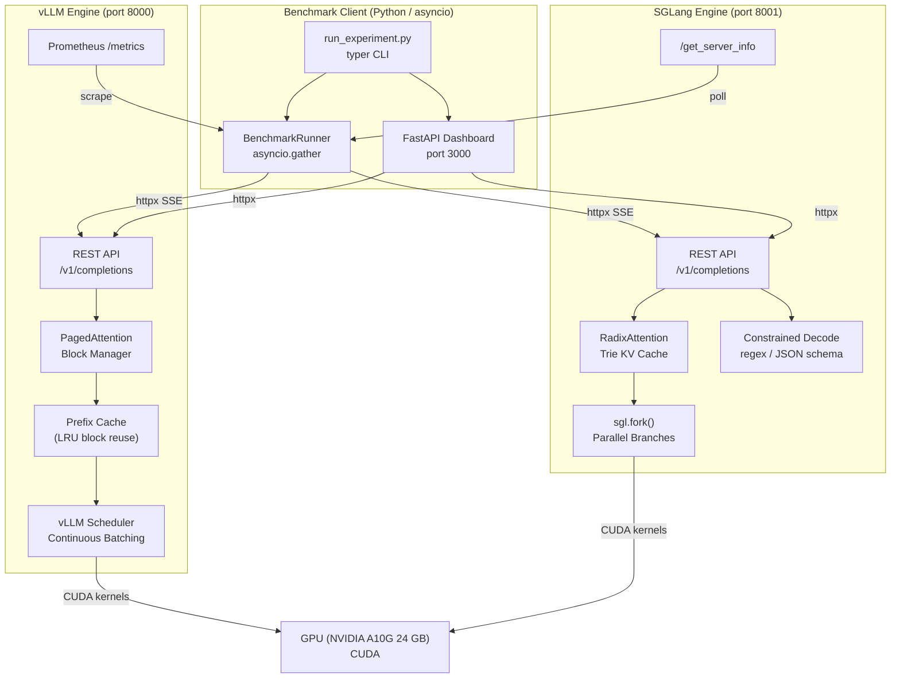
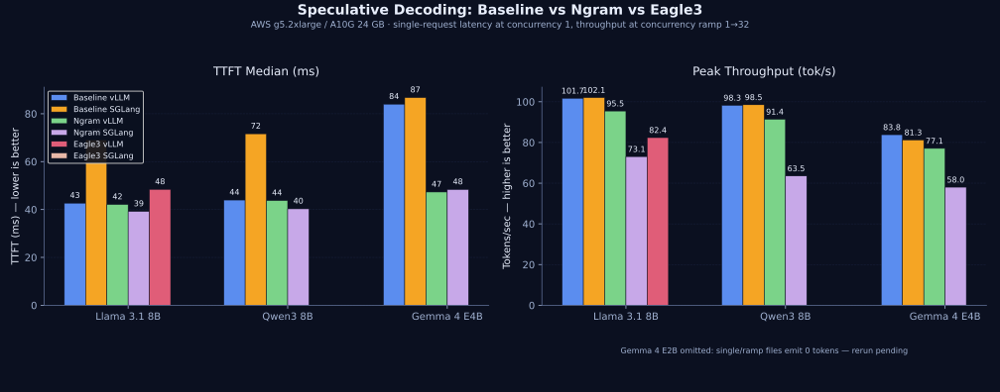

# vLLM vs SGLang — Inference Engine Benchmark System

A production-grade benchmark harness that rigorously compares **vLLM** and **SGLang** LLM inference engines across latency, throughput, KV-cache efficiency, structured generation, and speculative decoding.

## Summary

I benchmarked **14 models** (2B to 9B parameters) on a single NVIDIA A10G 24 GB GPU, running **5 scenarios** across both engines — **152 total result files, 100% success rate**. All 14 models have complete both-engine results. Speculative decoding: **Ngram ran successfully on Llama 3.1 8B and Qwen3 8B** (both engines); **Eagle3 ran on Llama 3.1 8B with vLLM only** (SGLang OOM on A10G; Qwen3 8B draft model not yet published). Extended phases (variance, concurrency-64, decode sweep) are in progress — see [Benchmark Execution Status](#benchmark-execution-status) below.

| Metric | vLLM | SGLang |
|---|---|---|
| Lower TTFT (single request) | **13 / 14 models** | 1 / 14 |
| Higher throughput (≤4B) | **5 / 6 models** | 1 / 6 (Gemma 3) |
| Higher throughput (7–9B) | — | — (tied within 3%) |
| Structured generation wins | **12 / 14** | 2 / 14 |
| Prefix-sharing TTFT wins | 4 / 14 | **10 / 14** |
| Best single-request TTFT | **20 ms** (Gemma 2 2B) | 30 ms (Gemma 2 2B) |
| Peak throughput | **265 tok/s** (Gemma 2 2B) | 258 tok/s (Gemma 2 2B) |

**Bottom line:** vLLM is the stronger general-purpose default on A10G-class hardware — wins TTFT on nearly every model, wins small-model throughput by 3–12%, and dominates structured generation. SGLang matches vLLM on 7–9B throughput, has a decisive advantage on Gemma 3 4B (+77% throughput), and wins prefix-sharing TTFT on 10/14 models.

**Hardware:** AWS g5.2xlarge (NVIDIA A10G 24 GB), sequential execution, one engine at a time
**Full reports:** [`reports/final_benchmark_report_2026-03-31.md`](reports/final_benchmark_report_2026-03-31.md)

---

## Benchmark Execution Status

_Last updated: 2026-04-17_

| Phase | Description | Status | Result Files |
|---|---|---|---|
| Baseline | 14 models × 5 scenarios × 2 engines | ✅ Complete | 152 / 152 |
| Speculative decoding | Llama 3.1 8B (Ngram + Eagle3), Qwen3 8B (Ngram) | ✅ Complete | In `results/` |
| Phase 1 — Variance | 4 models × 5 scenarios × 2 engines × 5 iterations | ✅ Complete | 201 / 200 |
| Phase 2 — Concurrency-64 | 4 models × `throughput_ramp_extended` × 2 engines × 1 iteration (cost-conscious) | 🔶 Partial | 3 / 8 (Qwen3-8B both engines, Mistral-7B vLLM) |
| Phase 3 — Decode sweep | 4 models × 4 lengths × 2 engines × (1–3 iter) | ✅ Complete | 72 / 72 |

### Phase 3 — Decode-Length Sweep Results

Prompt ≈ 512 tokens, `max_output_tokens ∈ {64, 256, 1024, 4096}`, concurrency 8, 180 requests/run. Mean across iterations. Full table: [`reports/decode_length_sweep_summary.md`](reports/decode_length_sweep_summary.md).

| Model | Decode | Engine | n | Tokens/s | TTFT p50 (ms) | TTFT p99 (ms) | Latency p99 (ms) | Err |
|---|---:|---|---:|---:|---:|---:|---:|---:|
| gemma-2-2b-it        |   64 | sglang | 3 | 519.1 |  39.4 |   67.9 |     918 | 0.009 |
| gemma-2-2b-it        |   64 | vllm   | 3 | 523.0 |  42.1 |  188.7 |    1108 | 0.000 |
| gemma-2-2b-it        |  256 | sglang | 3 | 484.3 |  41.9 |   70.5 |    3577 | 0.004 |
| gemma-2-2b-it        |  256 | vllm   | 3 | 493.8 |  36.5 |   60.4 |    3587 | 0.000 |
| gemma-2-2b-it        | 1024 | sglang | 3 | 469.7 |  37.9 |   56.3 |   12742 | 0.000 |
| gemma-2-2b-it        | 1024 | vllm   | 3 | 458.0 |  37.3 |   57.4 |   12864 | 0.000 |
| gemma-2-2b-it        | 4096 | sglang | 3 | 467.0 |  37.9 |   56.7 |   11044 | 0.000 |
| gemma-2-2b-it        | 4096 | vllm   | 3 | 459.2 |  37.5 |   53.7 |   12779 | 0.000 |
| phi-4-mini-instruct  |   64 | sglang | 3 | 340.1 |  49.2 |  105.2 |    1378 | 0.000 |
| phi-4-mini-instruct  |   64 | vllm   | 3 | 354.4 |  55.1 |   82.7 |    1321 | 0.000 |
| phi-4-mini-instruct  |  256 | sglang | 3 | 333.4 |  46.8 |   76.2 |    5350 | 0.000 |
| phi-4-mini-instruct  |  256 | vllm   | 3 | 346.2 |  56.0 |   70.5 |    5269 | 0.000 |
| phi-4-mini-instruct  | 1024 | sglang | 3 | 322.6 |  47.6 |   73.9 |   22881 | 0.000 |
| phi-4-mini-instruct  | 1024 | vllm   | 3 | 304.7 |  56.4 |   80.5 |   23149 | 0.000 |
| phi-4-mini-instruct  | 4096 | sglang | 3 | 293.5 |  48.3 |   99.9 |   87423 | 0.000 |
| phi-4-mini-instruct  | 4096 | vllm   | 3 | 287.2 |  56.8 |   74.5 |   79221 | 0.000 |
| gemma-3-4b-it        |   64 | sglang | 1 | 279.8 | 134.2 |  160.5 |    1596 | 0.006 |
| gemma-3-4b-it        |   64 | vllm   | 1 | 139.0 | 128.9 | 5297.3 |    7960 | 0.000 |
| gemma-3-4b-it        |  256 | sglang | 1 | 288.6 | 126.4 |  158.3 |    6091 | 0.006 |
| gemma-3-4b-it        |  256 | vllm   | 1 | 154.3 | 127.1 |  151.7 |   11556 | 0.000 |
| gemma-3-4b-it        | 1024 | sglang | 1 | 273.4 | 101.2 |  156.3 |   26063 | 0.000 |
| gemma-3-4b-it        | 1024 | vllm   | 1 | 150.5 | 122.5 |  149.1 |   45805 | 0.000 |
| gemma-3-4b-it        | 4096 | sglang | 1 | 272.7 | 100.7 |   154.7 |   36101 | 0.000 |
| gemma-3-4b-it        | 4096 | vllm   | 1 | 145.0 | 124.9 |  5344.9 |   71559 | 0.000 |
| llama-3-1-8b-instruct |   64 | sglang | 2 | 192.0 |  69.0 |   103.2 |    2390 | 0.000 |
| llama-3-1-8b-instruct |   64 | vllm   | 2 | 189.3 |  95.7 |   126.5 |    2418 | 0.000 |
| llama-3-1-8b-instruct |  256 | sglang | 2 | 190.3 |  69.5 |   116.6 |    9450 | 0.000 |
| llama-3-1-8b-instruct |  256 | vllm   | 2 | 189.4 |  93.2 |   127.1 |    9490 | 0.000 |
| llama-3-1-8b-instruct | 1024 | sglang | 2 | 186.8 |  69.0 |    95.3 |   39147 | 0.000 |
| llama-3-1-8b-instruct | 1024 | vllm   | 2 | 185.0 |  96.1 |   127.4 |   39366 | 0.000 |
| llama-3-1-8b-instruct | 4096 | sglang | 2 | 158.9 | 106.4 | 95647.9 |  299046 | 0.025 |
| llama-3-1-8b-instruct | 4096 | vllm   | 2 | 158.7 | 115.9 | 42609.6 |  284531 | 0.000 |

**Observations:**
- SGLang has consistently lower TTFT (p50) than vLLM; vLLM edges ahead on small-model decode throughput at short outputs.
- Gemma 3 4B: SGLang ≈ **1.8×** vLLM tokens/s at every decode length — matches the Phase 0 Gemma 3 finding.
- Llama 8B at 4096 tokens: p99 latency blows out to **~5 min** and tail TTFT spikes to **~95 s (sglang)** / **~48 s (vllm)** — the A10G is queue-saturated at concurrency 8 for this size.

### Phase 2 — Concurrency-64 Results (current)

Single-iteration runs at concurrency levels {1, 4, 8, 16, 32, 64}, 150 req/level (900 total). Prompt 128 tok, output 256 tok. Full table: [`reports/concurrency64_summary.md`](reports/concurrency64_summary.md).

| Model | Engine | Succ | Tokens/s | TTFT p50 (ms) | TTFT p99 (ms) | Latency p99 (ms) | Err |
|---|---|---:|---:|---:|---:|---:|---:|
| Qwen3-8B                          | vllm   | 900/900 | 113.7 | 103.2 | 232.2 | 11683 | 0.000 |
| Qwen3-8B                          | sglang | 900/900 | 113.9 |  73.5 | 403.0 | 11663 | 0.000 |
| Mistral-7B-Instruct-v0.3          | vllm   | 900/900 | 123.5 |  93.0 | 283.9 | 10136 | 0.000 |
| Mistral-7B-Instruct-v0.3          | sglang | — | pending | | | | |
| google/gemma-2-9b-it              | vllm   | — | pending | | | | |
| google/gemma-2-9b-it              | sglang | — | pending | | | | |
| meta-llama/Llama-3.1-8B-Instruct  | vllm   | — | pending | | | | |
| meta-llama/Llama-3.1-8B-Instruct  | sglang | — | pending | | | | |

**Observations (from completed runs):**
- All completed cells hit 0% error rate at concurrency=64 — no OOMs on A10G 24GB for 7–8B-class models at 128/256 prompt/output.
- Qwen3-8B aggregate throughput is engine-agnostic (~114 tok/s either way); SGLang has lower median TTFT (73.5 ms vs 103.2 ms), vLLM has tighter tail TTFT (p99 232 ms vs 403 ms).
- Mistral-7B (vLLM) leads absolute throughput at 123.5 tok/s — expected since it's smaller than Qwen3-8B.

### Other pending

- **Phase 2 resume:** 5 cells remaining (Llama 3.1 8B both engines, Mistral-7B sglang, gemma-2-9b-it both engines). Re-running `--phase2` is idempotent — the script auto-skips any cell with an existing result file.
  ```bash
  nohup bash scripts/run_new_benchmarks.sh --phase2 2>&1 | tee logs/phase2_resume_$(date +%Y%m%dT%H%M%S).log &
  ```
- **Variance analysis re-run:** Phase 1 data now complete — run `python -m analysis.variance_analysis --results-dir results_variance`
- **Gemma 4 benchmarks:** Pending GPU availability after Phase 2 wraps

```bash
# Resume Phase 2 (after uncommenting the model loop)
nohup bash scripts/run_new_benchmarks.sh --phase2 2>&1 | tee logs/phase2_$(date +%Y%m%dT%H%M%S).log &

# Run Phase 3
nohup bash scripts/run_new_benchmarks.sh --phase3 2>&1 | tee logs/phase3_$(date +%Y%m%dT%H%M%S).log &

# Re-run variance analysis (Phase 1 complete)
conda run -n base python -m analysis.variance_analysis --results-dir results_variance
conda run -n base python -m analysis.tpot_analysis --results-dir results_variance
```

---

## Architecture Diagram



---

## Project Structure

```
inference-engine-benchmark-system/
├── engines/
│   ├── base_client.py          # Abstract base + GenerationResult / EngineMetrics + retry helper
│   ├── vllm_client.py          # vLLM OpenAI-compat client (SSE streaming, Prometheus metrics)
│   ├── sglang_client.py        # SGLang client (REST + native sgl.Runtime support)
│   └── py.typed                # PEP 561 type marker
│
├── benchmarks/
│   ├── metrics.py              # LatencyStats, ThroughputStats, CDF, compare_metrics
│   ├── scenarios.py            # Scenario configs + default prompt-pack mapping
│   ├── prompt_packs.py         # Prompt-pack loaders (JSONL/JSON)
│   └── runner.py               # BenchmarkRunner (asyncio.gather, metrics polling, JSON output)
│
├── sglang_programs/            # Reserved for native @sgl.function programs
│
├── dashboard/
│   └── app.py                  # FastAPI: REST API + WebSocket live metrics stream
│
├── analysis/
│   ├── report.py               # HTML report generator (matplotlib CDF/throughput/KV charts)
│   └── final_report.py         # Aggregated markdown final summary across runs
│
├── prompts/
│   ├── short_chat.jsonl        # Low-latency chat prompts
│   ├── long_generation.jsonl   # Decode-heavy prompts
│   ├── long_context.jsonl      # Context-stress prompts
│   ├── structured_json.jsonl   # Schema-oriented extraction prompts
│   ├── reasoning.jsonl         # Multi-step / reasoning prompts
│   ├── shared_prefix.json      # Shared-prefix cache benchmark pack
│   └── schemas/                # JSON schemas referenced by structured prompts
│
├── tests/                      # pytest suite (httpx mocking via respx, no live engines needed)
├── results/                    # Raw JSON results — baseline (14 models × 5 scenarios × 2 engines)
├── results_variance/           # Phase 1 — variance subset (5 iterations per scenario/engine/model)
├── results_concurrency64/      # Phase 2 — concurrency-64 extended ramp (7–9B models)
├── results_decode_sweep/       # Phase 3 — decode-length sweep (output tokens: 64/256/1024/4096)
├── reports/                    # Generated reports and SVG figures
│   └── figures/                # SVG charts (TTFT, throughput, tradeoff)
├── docs/                       # Detailed guides (getting started, spec-dec runbook, roadmap)
├── scripts/
│   ├── run_all_benchmarks.sh      # Full suite runner (14 models + spec-dec)
│   ├── run_new_benchmarks.sh      # Phase 1/2/3 extended benchmarks (variance, concurrency-64, decode sweep)
│   ├── run_variance_subset.sh     # Phase 1 only — variance credibility backbone
│   ├── run_concurrency_64.sh      # Phase 2 only — concurrency=64 extended ramp
│   ├── run_decode_sweep.sh        # Phase 3 only — decode-length sweep
│   ├── run_gemma4_benchmarks.sh   # Gemma 4 baseline + ngram spec-dec (requires HF token)
│   └── run_phase_a_pending.sh     # Eagle3 spec-dec runs
├── deploy/
│   ├── ec2_deploy.sh           # Self-contained bash AWS deployment
│   └── terraform/              # Terraform module for team/repeatable workflows
├── run_experiment.py           # Typer CLI (run / compare / matrix / report / serve / health)
├── docker-compose.yml          # 6 engine profiles: baseline + Eagle3 + Ngram for each engine
├── Dockerfile.dashboard        # Lightweight dashboard container
└── pyproject.toml              # Python 3.11+ project metadata
```

---

## Quick Start

### 1. Install

```bash
pip install -e ".[dev]"
```

### 2. Configure environment

```bash
cp .env.example .env
# Edit .env — add your HUGGING_FACE_HUB_TOKEN for gated models (Llama, Gemma, Mistral)
mkdir -p model-cache
```

### 3. Start one engine at a time (single GPU)

```bash
# vLLM
docker compose --profile vllm up -d vllm
curl http://localhost:8000/health

# SGLang
docker compose --profile sglang up -d sglang
curl http://localhost:8001/health
```

> On a single A10G, run engines **sequentially** — start one, benchmark, stop, then switch.

### 4. Check engine health

```bash
python run_experiment.py health
python run_experiment.py health --engines vllm
python run_experiment.py health --engines sglang
```

For detailed setup guides see:
- [`docs/GETTING_STARTED.md`](docs/GETTING_STARTED.md)
- [`docs/SINGLE_GPU_OPERATION.md`](docs/SINGLE_GPU_OPERATION.md)
- [`docs/VALIDATED_BENCHMARK_RUNBOOK.md`](docs/VALIDATED_BENCHMARK_RUNBOOK.md)

---

## CLI Usage

```bash
# Single scenario
python run_experiment.py run --scenario single_request_latency --engines vllm

# Both engines
python run_experiment.py run --scenario throughput_ramp --engines vllm,sglang

# Custom model + prompt pack
python run_experiment.py run \
  --scenario prefix_sharing_benefit \
  --engines vllm,sglang \
  --model Qwen/Qwen2.5-7B-Instruct \
  --prompt-pack shared_prefix

# Head-to-head comparison
python run_experiment.py compare --scenario structured_generation_speed

# Sequential matrix (scenario × engine × iteration)
python run_experiment.py matrix \
  --model Qwen/Qwen2.5-7B-Instruct \
  --scenarios single_request_latency,throughput_ramp \
  --engines sglang,vllm \
  --iterations 2 --cooldown-seconds 300

# Reports
python run_experiment.py report --output report.html
python run_experiment.py final-report --output final_report.md

# Dashboard
python run_experiment.py serve    # http://localhost:3000

# List available scenarios and prompt packs
python run_experiment.py list-scenarios
python run_experiment.py list-prompt-packs
```

---

## Benchmark Scenarios

| Scenario | Requests | Concurrency | Focus |
|---|---|---|---|
| `single_request_latency` | 50 | 1 | P50/P95/P99 TTFT, pure engine overhead |
| `throughput_ramp` | 100×7 levels | 1 → 32 | Max tokens/sec, saturation point |
| `long_context_stress` | 20 | 4 | 8K-token prompts, GPU memory pressure |
| `prefix_sharing_benefit` | 100 | 8 | 60% shared prefix, KV cache reuse |
| `structured_generation_speed` | 200 | 16 | JSON schema-constrained decode |

### Extended Benchmark Phases

Three additional benchmark phases run on top of the baseline suite:

| Phase | Script | Scenarios | Iterations | Output Dir | Status |
|---|---|---|---|---|---|
| Phase 1 — Variance | `scripts/run_new_benchmarks.sh --phase1` | 5 baseline | 5× | `results_variance/` | ✅ Complete (201 files) |
| Phase 2 — Concurrency-64 | `scripts/run_new_benchmarks.sh --phase2` | `throughput_ramp_extended` | 3× | `results_concurrency64/` | 🔶 Partial — Llama 3.1 8B done, 3 models pending |
| Phase 3 — Decode Sweep | `scripts/run_new_benchmarks.sh --phase3` | `decode_length_sweep_{64,256,1024,4096}` | 3× | `results_decode_sweep/` | ⬜ Not started |

**Phase 2** adds `concurrency=64` to find the saturation point and OOM ceiling on 7–9B models. **Phase 3** fixes the prompt at ~512 tokens and sweeps `max_output_tokens` ∈ {64, 256, 1024, 4096} to isolate how output length affects throughput.

Run all phases in the background:
```bash
nohup bash scripts/run_new_benchmarks.sh 2>&1 | tee logs/new_benchmarks_$(date +%Y%m%dT%H%M%S).log &
```

Analyse results after completion:
```bash
python -m analysis.variance_analysis      --results-dir results_variance
python -m analysis.tpot_analysis          --results-dir results_variance
python -m analysis.decode_length_analysis --results-dir results_decode_sweep
python -m analysis.goodput                --results-dir results_variance
```

---

### Prompt Packs

Default scenario → pack mapping (override with `--prompt-pack`):

| Pack | File | Used by |
|---|---|---|
| `short_chat` | `prompts/short_chat.jsonl` | `single_request_latency` |
| `long_generation` | `prompts/long_generation.jsonl` | `throughput_ramp` |
| `long_context` | `prompts/long_context.jsonl` | `long_context_stress` |
| `shared_prefix` | `prompts/shared_prefix.json` | `prefix_sharing_benefit` |
| `structured_json` | `prompts/structured_json.jsonl` | `structured_generation_speed` |

---

## Speculative Decoding

Speculative decoding is an **engine startup configuration**, not a separate scenario. The same scenarios run against 6 engine variants for apples-to-apples comparison.

| Variant | Engine | Method | Draft model needed |
|---|---|---|---|
| `vllm` | vLLM | Baseline | No |
| `vllm-eagle3` | vLLM | Eagle3 | Yes (~1–2 GB) |
| `vllm-ngram` | vLLM | Ngram | No |
| `sglang` | SGLang | Baseline | No |
| `sglang-eagle3` | SGLang | Eagle3 | Yes (~1–2 GB) |
| `sglang-ngram` | SGLang | Ngram | No |

```bash
# Example: Eagle3 on Llama 3.1 8B with vLLM
export MODEL=meta-llama/Llama-3.1-8B-Instruct
docker compose --profile vllm-eagle3 up -d vllm-eagle3 && sleep 180
python run_experiment.py run -s single_request_latency -e vllm-eagle3 --model $MODEL
docker compose --profile vllm-eagle3 down
```

Full runbook and draft model reference: [`docs/SPECULATIVE_DECODING.md`](docs/SPECULATIVE_DECODING.md)

---

## Models Tested

### Hardware & Software

| Component | Details |
|---|---|
| GPU | NVIDIA A10G 24 GB |
| Instance | AWS g5.2xlarge (8 vCPU, 32 GB RAM) |
| vLLM | v0.18.0-cu130 |
| SGLang | nightly-dev-cu13-20260321 |
| Precision | bfloat16 |

### A10G 24 GB — All 14 Models Benchmarked

| Model | Size | Category | Both Engines |
|---|---|---|---|
| google/gemma-2-2b-it | 2B | General | Yes |
| HuggingFaceTB/SmolLM3-3B | 3B | General | Yes |
| meta-llama/Llama-3.2-3B-Instruct | 3B | General | Yes |
| microsoft/Phi-3-mini-4k-instruct | 3.8B | General | Yes |
| google/gemma-3-4b-it | 4B | General | Yes |
| microsoft/Phi-4-mini-instruct | 4B | General | Yes |
| deepseek-ai/DeepSeek-R1-Distill-Qwen-7B | 7B | Reasoning | Yes |
| Qwen/Qwen2.5-7B-Instruct | 7B | General | Yes |
| mistralai/Mistral-7B-Instruct-v0.3 | 7B | General | Yes |
| meta-llama/Llama-3.1-8B-Instruct | 8B | General | Yes |
| Qwen/Qwen3-8B | 8B | General | Yes |
| ibm-granite/granite-3.3-8b-instruct | 8B | Enterprise | Yes |
| deepseek-ai/DeepSeek-R1-Distill-Llama-8B | 8B | Reasoning | Yes |
| google/gemma-2-9b-it | 9B | General | Yes |

> **Not benchmarked:** Qwen3-30B-A3B (~60 GB at bf16) and Gemma 3 12B (~24 GB weights, no KV cache headroom) exceed A10G capacity.

### A100/H100 (larger hardware — future scope)

| Model | Min GPU | Notes |
|---|---|---|
| Mistral Small 3.2 24B | A100 40 GB | Strong multilingual |
| Qwen3 32B | A100 80 GB | Top open-weight at 32B |
| Llama 3.3 70B | 2× A100 80 GB | Full Eagle3 draft support |

---

## Benchmark Results

### Visual Summary

#### Single-request latency (TTFT P95)


#### Throughput tokens/sec


#### Throughput requests/sec


#### Throughput vs Latency tradeoff

> **Interactive version** (hover for exact values, zoom, toggle engines): [`reports/figures/throughput_tradeoff_interactive.html`](reports/figures/throughput_tradeoff_interactive.html)
> Bubble size = model parameter count. Top-left is ideal: high throughput, low latency.


#### P95 latency under load


---

### 1. Single Request Latency

TTFT and per-request decode speed at concurrency 1. **Lower TTFT** is better; **higher tok/s** is better.

| Model | vLLM TTFT | SGLang TTFT | vLLM tok/s | SGLang tok/s |
|---|---|---|---|---|
| gemma-2-2b-it | **20 ms** | 30 ms | 77.6 | **78.2** |
| smollm3-3b | **24 ms** | 57 ms | **69.2** | 63.4 |
| llama-3.2-3b-instruct | **23 ms** | 32 ms | 66.3 | **67.7** |
| phi-3-mini-4k-instruct | **25 ms** | 43 ms | **57.8** | 55.7 |
| gemma-3-4b-it | 87 ms | **78 ms** | 23.8 | **45.0** |
| phi-4-mini-instruct | **33 ms** | 40 ms | **56.8** | 52.7 |
| deepseek-r1-distill-qwen-7b | **40 ms** | 66 ms | 30.5 | **30.9** |
| qwen2.5-7b-instruct | **41 ms** | 66 ms | 30.6 | **30.9** |
| mistral-7b-instruct-v0.3 | **41 ms** | 62 ms | 31.8 | 31.8 |
| llama-3.1-8b-instruct | **43 ms** | 69 ms | 30.3 | 30.3 |
| qwen3-8b | **44 ms** | 72 ms | 29.2 | **29.4** |
| granite-3.3-8b-instruct | **46 ms** | 76 ms | **27.7** | 27.6 |
| deepseek-r1-distill-llama-8b | **42 ms** | 69 ms | 30.3 | 30.3 |
| gemma-2-9b-it | **74 ms** | 83 ms | 24.0 | **24.1** |

**vLLM wins TTFT on 13/14 models.** The exception is Gemma 3 4B, where vLLM requires `--enforce-eager` (disabling CUDA graphs due to its sliding window + global attention interleaving), giving SGLang a 9 ms edge. At the decode speed level (tok/s), differences are negligible at concurrency 1 — engines are GPU-bound equally.

---

### 2. Sustained Throughput

Peak tokens/second during throughput ramp (concurrency 1 → 32). **Higher is better.**

| Model | vLLM tok/s | SGLang tok/s | Winner |
|---|---|---|---|
| gemma-2-2b-it | **265** | 258 | vLLM +3% |
| smollm3-3b | **230** | 205 | vLLM +12% |
| llama-3.2-3b-instruct | 223 | **226** | SGLang +1% |
| phi-3-mini-4k-instruct | **191** | 187 | vLLM +2% |
| gemma-3-4b-it | 84 | **149** | **SGLang +77%** |
| phi-4-mini-instruct | **189** | 176 | vLLM +7% |
| deepseek-r1-distill-qwen-7b | 106 | 106 | Tie |
| qwen2.5-7b-instruct | 105 | **106** | SGLang +1% |
| mistral-7b-instruct-v0.3 | 107 | 107 | Tie |
| llama-3.1-8b-instruct | 102 | 102 | Tie |
| qwen3-8b | 98 | **99** | SGLang +1% |
| granite-3.3-8b-instruct | 93 | 93 | Tie |
| deepseek-r1-distill-llama-8b | 102 | 102 | Tie |
| gemma-2-9b-it | **80** | 78 | vLLM +3% |

**vLLM wins on ≤4B models** (3–12%). At 7–9B scale, engines converge to the same GPU-bottlenecked ceiling.

> **Anomaly — Gemma 3 4B vLLM (84 tok/s vs SGLang 149):** vLLM must run with `--enforce-eager`, disabling CUDA graph capture for Gemma 3's interleaved sliding-window attention. This prevents kernel fusion at high concurrency, causing 2,137 s total wall time vs SGLang's 1,200 s for the same 179K tokens. Not a scheduler issue — it's a CUDA graph incompatibility in vLLM 0.6.x with this architecture.
>
> **Anomaly — SmolLM3 3B SGLang (205 vs vLLM 230):** SGLang is slower for SmolLM3 3B despite generally winning at large-model scale. SmolLM3 uses an updated HuggingFace architecture that vLLM's kernel selection handles more efficiently at the time of benchmarking.
>
> **Anomaly — Gemma 2 9B SGLang p95 (46,027 ms vs vLLM 14,399 ms):** The p95 tail latency under throughput ramp is ~3× worse for SGLang on Gemma 2 9B. Gemma 2 uses alternating local/global attention layers; SGLang's continuous batch scheduler appears to stall under high queue depth for this attention pattern, causing severe tail-latency spikes. The median and throughput numbers are comparable — this is a scheduling outlier under extreme concurrency, not a general regression.

---

### 3. Long Context Stress (8K Tokens)

Performance with 8,192-token input prompts (20 requests, ~4 concurrent). Tests KV cache handling under memory pressure. **tok/s = total output tokens generated per second across all concurrent requests.**

| Model | vLLM TTFT | SGLang TTFT | vLLM tok/s | SGLang tok/s |
|---|---|---|---|---|
| gemma-2-2b-it | **34 ms** | 40 ms | **311.5** | 290.6 |
| smollm3-3b | **42 ms** | 71 ms | **265.0** | 234.6 |
| llama-3.2-3b-instruct | **40 ms** | 43 ms | **254.5** | 253.6 |
| phi-3-mini-4k-instruct | 53 ms | **48 ms** | **231.3** | 211.6 |
| gemma-3-4b-it | 127 ms | **75 ms** | 98.0 | **180.2** |
| phi-4-mini-instruct | 47 ms | **38 ms** | 212.0 | **211.8** |
| deepseek-r1-distill-qwen-7b | 87 ms | **58 ms** | 121.2 | **125.9** |
| qwen2.5-7b-instruct | 91 ms | **59 ms** | 118.4 | **126.0** |
| mistral-7b-instruct-v0.3 | 94 ms | **93 ms** | **117.4** | 112.8 |
| llama-3.1-8b-instruct | 90 ms | **63 ms** | 115.7 | 115.6 |
| qwen3-8b | 102 ms | **70 ms** | 110.7 | **115.5** |
| granite-3.3-8b-instruct | **110 ms** | 113 ms | **100.7** | 99.1 |
| deepseek-r1-distill-llama-8b | 92 ms | **63 ms** | **115.8** | 115.3 |
| gemma-2-9b-it | 125 ms | 125 ms | 80.8 | **82.5** |

**SGLang wins long-context TTFT on 8/14 models**, particularly at 7–9B scale. This contrasts with single-request latency where vLLM dominates. On decode throughput, vLLM leads for ≤3B models while SGLang edges ahead at 7–9B — consistent with the throughput ramp pattern. Gemma 3 4B is again the outlier: SGLang delivers 180 tok/s vs vLLM's 98 due to the same `--enforce-eager` constraint.

---

### 4. Prefix Sharing (60% Overlap)

KV cache reuse across 100 requests with 60% shared prefix. **tok/s = total output tokens per second across all concurrent requests.**

| Model | vLLM TTFT | SGLang TTFT | vLLM tok/s | SGLang tok/s |
|---|---|---|---|---|
| gemma-2-2b-it | 44 ms | **40 ms** | **567.2** | 557.9 |
| smollm3-3b | **42 ms** | 72 ms | **522.0** | 398.6 |
| llama-3.2-3b-instruct | 50 ms | **41 ms** | 489.1 | **489.3** |
| phi-3-mini-4k-instruct | 59 ms | **57 ms** | **397.6** | 396.6 |
| gemma-3-4b-it | 121 ms | **103 ms** | 178.6 | **326.9** |
| phi-4-mini-instruct | **51 ms** | 56 ms | **403.9** | 375.6 |
| deepseek-r1-distill-qwen-7b | 87 ms | **78 ms** | **235.7** | 235.1 |
| qwen2.5-7b-instruct | **90 ms** | 92 ms | 228.9 | **233.0** |
| mistral-7b-instruct-v0.3 | 93 ms | 93 ms | **228.2** | 220.6 |
| llama-3.1-8b-instruct | 93 ms | **65 ms** | **219.4** | 217.8 |
| qwen3-8b | 95 ms | **59 ms** | **212.2** | 210.4 |
| granite-3.3-8b-instruct | 110 ms | **66 ms** | **199.0** | 198.1 |
| deepseek-r1-distill-llama-8b | 94 ms | **55 ms** | 219.5 | **225.8** |
| gemma-2-9b-it | 128 ms | **125 ms** | **167.2** | 157.4 |

**SGLang wins prefix-sharing TTFT on 10/14 models.** Its radix-tree KV cache provides superior prefix reuse, shaving 20–40 ms at 7–9B scale. Decode throughput favours vLLM for most models once prefix overhead is amortised; Gemma 3 4B is again the exception (SGLang +83%) for the same `--enforce-eager` reason.

---

### 5. Structured Generation (JSON Schema)

JSON-constrained generation throughput across 200 requests. **Higher tok/s is better.**

| Model | vLLM tok/s | SGLang tok/s | Winner |
|---|---|---|---|
| gemma-2-2b-it | **1,225** | 957 | vLLM +28% |
| smollm3-3b | **930** | 774 | vLLM +20% |
| llama-3.2-3b-instruct | **970** | 909 | vLLM +7% |
| phi-3-mini-4k-instruct | **785** | 783 | Tie |
| gemma-3-4b-it | 340 | **617** | SGLang +81% |
| phi-4-mini-instruct | **736** | 669 | vLLM +10% |
| deepseek-r1-distill-qwen-7b | **452** | 451 | Tie |
| qwen2.5-7b-instruct | **456** | 384 | vLLM +19% |
| mistral-7b-instruct-v0.3 | **440** | 411 | vLLM +7% |
| llama-3.1-8b-instruct | **426** | 423 | vLLM +1% |
| qwen3-8b | 398 | 398 | Tie |
| granite-3.3-8b-instruct | 368 | **379** | SGLang +3% |
| deepseek-r1-distill-llama-8b | **426** | 422 | vLLM +1% |
| gemma-2-9b-it | **317** | 290 | vLLM +9% |

**vLLM dominates structured generation** — wins 12/14 models. Most pronounced on smaller models (Gemma 2 2B: +28%, SmolLM3: +20%).

---

### 6. TPOT & Goodput Analysis

**TPOT** (Time Per Output Token) = inter-token decode latency after the first token: `(total_ms − ttft_ms) / max(output_tokens − 1, 1)`. Computed per request from existing result data; no re-runs required. Full per-scenario tables: [`reports/tpot_analysis.md`](reports/tpot_analysis.md).

#### TPOT at concurrency 1 (single_request_latency, P50 ms)

At serial load, TPOT reflects raw GPU decode speed — engines are near-identical for every model except Gemma 3 4B, where vLLM's `--enforce-eager` constraint doubles decode time.

| Model | vLLM P50 | vLLM P99 | SGLang P50 | SGLang P99 |
|---|---|---|---|---|
| gemma-2-2b-it | 12.9 | 13.1 | 12.8 | 12.9 |
| smollm3-3b | 14.6 | 14.7 | 15.7 | 15.7 |
| llama-3.2-3b-instruct | 15.0 | 15.0 | 14.7 | 14.7 |
| phi-3-mini-4k-instruct | 17.4 | 17.4 | 17.7 | 18.0 |
| **gemma-3-4b-it** | **41.0** | **42.3** | **21.7** | **21.9** |
| phi-4-mini-instruct | 17.8 | 18.0 | 18.8 | 19.3 |
| deepseek-r1-distill-qwen-7b | 32.7 | 33.1 | 32.4 | 32.4 |
| qwen2.5-7b-instruct | 32.7 | 33.3 | 32.3 | 32.8 |
| mistral-7b-instruct-v0.3 | 31.5 | 31.8 | 31.4 | 31.7 |
| llama-3.1-8b-instruct | 35.7 | 40.3 | 33.0 | 38.9 |
| qwen3-8b | 35.6 | 37.2 | 37.0 | 40.9 |
| granite-3.3-8b-instruct | 36.1 | 36.1 | 36.0 | 36.0 |
| deepseek-r1-distill-llama-8b | 33.1 | 33.1 | 32.9 | 33.0 |
| gemma-2-9b-it | 41.4 | 42.4 | 41.2 | 42.2 |

**Takeaway:** At concurrency 1, both engines are GPU-bound equally. TPOT tracks model size. The sole outlier is Gemma 3 4B: SGLang achieves 21.7 ms vs vLLM's 41.0 ms — the same CUDA graph incompatibility that drives the throughput gap.

#### TPOT tail latency under load (throughput_ramp, P99 ms)

Under high concurrency, TPOT P99 reveals scheduling behaviour. vLLM holds tail latency significantly better on larger models.

| Model | vLLM P99 | SGLang P99 | SGLang / vLLM |
|---|---|---|---|
| gemma-2-2b-it | 17.6 | 18.4 | 1.05× |
| smollm3-3b | **21.2** | 41.9 | 2.0× worse |
| llama-3.2-3b-instruct | **20.6** | 21.3 | 1.04× |
| phi-3-mini-4k-instruct | 30.7 | **29.1** | 0.95× |
| gemma-3-4b-it | **44.6** | 56.8 | 1.27× worse |
| phi-4-mini-instruct | **28.9** | 32.7 | 1.13× worse |
| qwen2.5-7b-instruct | **37.6** | 36.9 | 0.98× |
| mistral-7b-instruct-v0.3 | **39.0** | 39.1 | 1.00× |
| llama-3.1-8b-instruct | **92.7** | 220.8 | 2.4× worse |
| **qwen3-8b** | **54.3** | **256.2** | **4.7× worse** |
| granite-3.3-8b-instruct | **47.5** | 48.7 | 1.03× |
| deepseek-r1-distill-llama-8b | **40.4** | 41.1 | 1.02× |
| deepseek-r1-distill-qwen-7b | **35.8** | 36.8 | 1.03× |
| gemma-2-9b-it | **72.1** | 80.1 | 1.11× worse |

**Takeaway:** vLLM tail latency is substantially more stable at 7–9B scale under high concurrency. SGLang P99 TPOT spikes to 4.7× vLLM on Qwen3 8B and 2.4× on Llama 3.1 8B — the same scheduler stall behaviour that produces its P95 tail-latency anomaly on Gemma 2 9B. At ≤4B, the gap closes to <5% for most models.

#### Goodput (TTFT ≤ 200 ms, TPOT ≤ 40 ms)

Goodput = requests/sec satisfying both SLOs simultaneously, summed across all scenarios. Re-run with different thresholds: `python -m analysis.goodput --ttft-slo-ms <X> --tpot-slo-ms <Y>`.

| Model | vLLM goodput | SGLang goodput | SLO pass % (vLLM / SGLang) |
|---|---|---|---|
| gemma-2-2b-it | **1.47 rps** | 1.32 rps | 99.9% / 97.0% |
| smollm3-3b | **1.12 rps** | 0.90 rps | 98.8% / 88.9% |
| llama-3.2-3b-instruct | 1.08 rps | **1.11 rps** | 98.2% / 99.9% |
| phi-3-mini-4k-instruct | 0.90 rps | **0.92 rps** | 96.0% / 99.8% |
| **gemma-3-4b-it** | 0.004 rps | **0.60 rps** | 1.0% / 81.4% |
| phi-4-mini-instruct | 0.94 rps | **1.00 rps** | 98.8% / 98.9% |
| deepseek-r1-distill-qwen-7b | **0.51 rps** | 0.47 rps | 97.1% / 91.3% |
| qwen2.5-7b-instruct | 0.52 rps | **0.53 rps** | 97.1% / 98.6% |
| mistral-7b-instruct-v0.3 | 0.51 rps | **0.53 rps** | 95.7% / 99.9% |
| llama-3.1-8b-instruct | 0.28 rps | **0.42 rps** | 60.4% / 71.7% |
| qwen3-8b | **0.34 rps** | 0.37 rps | 78.4% / 50.9% |
| granite-3.3-8b-instruct | **0.25 rps** | 0.24 rps | 54.3% / 53.8% |
| deepseek-r1-distill-llama-8b | **0.47 rps** | 0.47 rps | 94.0% / 93.1% |
| gemma-2-9b-it | 0 rps | 0 rps | 0% / 0% — TPOT ~44 ms exceeds SLO |

**Takeaways:**
- **Gemma 2 2B / SmolLM3** — vLLM leads by 10–12% in goodput (CUDA graphs, lower TPOT variance).
- **Gemma 3 4B** — SGLang delivers 150× the goodput of vLLM (0.60 vs 0.004 rps) because vLLM almost never meets the TPOT SLO without CUDA graphs.
- **Llama 3.1 8B** — SGLang wins goodput (0.42 vs 0.28 rps) despite vLLM's lower serial TTFT, because SGLang's better TTFT under concurrent load keeps more requests inside the 200 ms window.
- **Gemma 2 9B** — neither engine meets a 40 ms TPOT SLO (native TPOT ~44 ms); tighten to ≤50 ms to get meaningful results.

---

### 7. Speculative Decoding

#### Llama 3.1 8B

| Variant | Engine | TTFT (med) | Single tok/s | Peak Throughput |
|---|---|---|---|---|
| Baseline | vLLM | 43 ms | 30.3 | 102 tok/s |
| Baseline | SGLang | 67 ms | 30.3 | 102 tok/s |
| Ngram | vLLM | 42 ms | 27.8 | 96 tok/s |
| Ngram | SGLang | 39 ms | 26.0 | 73 tok/s |
| Eagle3 | vLLM | 48 ms | 24.6 | 82 tok/s |
| Eagle3 | SGLang | — | — | — |

> **Eagle3 draft model (vLLM):** `RedHatAI/Llama-3.1-8B-Instruct-speculator.eagle3`
> SGLang Eagle3 exceeds A10G 24 GB capacity (main + draft + KV cache). Future scope on ≥40 GB GPUs.

#### Qwen3 8B

| Variant | Engine | TTFT (med) | Single tok/s | Peak Throughput |
|---|---|---|---|---|
| Baseline | vLLM | 44 ms | 29.2 | 98 tok/s |
| Baseline | SGLang | 72 ms | 29.4 | 99 tok/s |
| Ngram | vLLM | 44 ms | 26.8 | 91 tok/s |
| Ngram | SGLang | 40 ms | 25.6 | 64 tok/s |

> Eagle3 not tested — `RedHatAI/Qwen3-8B-speculator.eagle3` not yet published.



> **Interactive version** (hover, zoom, toggle variants): [`reports/figures/speculative_decoding_interactive.html`](reports/figures/speculative_decoding_interactive.html)

---

### Model Size vs Performance

How key metrics scale with model size (best engine, single request):

| Size | TTFT range | tok/s range | Peak throughput |
|---|---|---|---|
| 2–3B | 20–57 ms | 62–78 tok/s | 230–265 tok/s |
| 3.8–4B | 25–87 ms | 24–57 tok/s | 84–191 tok/s |
| 7B | 40–66 ms | 30–32 tok/s | 105–107 tok/s |
| 8B | 42–76 ms | 28–30 tok/s | 93–102 tok/s |
| 9B | 74–83 ms | 24 tok/s | 78–80 tok/s |

TTFT grows ~4× from 2B to 9B. Throughput drops ~3×. The steepest jump is at 7B where VRAM pressure begins on 24 GB.

---

### Key Findings

**vLLM wins TTFT at low concurrency.** 13/14 models, 20–60% faster to first token. CUDA graph execution eliminates kernel launch overhead.

**Throughput converges at 7–9B.** Both engines hit the same GPU-bottlenecked ceiling. Differences <3%.

**vLLM wins small-model throughput.** SmolLM3 3B: 230 vs 205 (+12%), Phi-4 mini: 189 vs 176 (+7%), Gemma 2 2B: 265 vs 258 (+3%).

**Gemma 3 is SGLang's strongest case.** vLLM requires `--enforce-eager` for hybrid attention, giving SGLang +77% throughput (149 vs 84 tok/s). Architectural compatibility issue, not fundamental engine difference.

**SGLang wins prefix sharing.** Radix-tree KV cache provides better prefix reuse — wins TTFT on 10/14 models.

**vLLM dominates structured generation.** 12/14 wins. Gap ranges from marginal (<1%) to substantial (+28%).

**Speculative decoding hurts on A10G.** Ngram: vLLM −7%, SGLang −28%. Eagle3: vLLM −20%. Draft proposal overhead exceeds decode savings. Constrained `--max-model-len 2048` limits batch efficiency. Better realized on ≥40 GB GPUs.

### When to Use Which Engine

| Use Case | Recommendation | Why |
|---|---|---|
| Latency-sensitive serving | **vLLM** | Wins TTFT on 13/14 models |
| Structured/JSON output | **vLLM** | Wins throughput on 12/14 models |
| Prefix-heavy workloads (RAG) | **SGLang** | Wins prefix-sharing TTFT on 10/14 |
| High-throughput batch (7B+) | Either | Tied within 3% |
| Gemma 3 models | **SGLang** | +77% throughput (vLLM CUDA graph limitation) |

---

## Architecture Deep-Dive

### vLLM — PagedAttention

- KV cache split into fixed-size **pages** (blocks), managed by a block allocator
- **Prefix cache**: LRU reuse of blocks for repeated prompt prefixes
- **Continuous batching**: adds/removes requests mid-batch for high utilisation
- Metrics exposed via Prometheus at `/metrics`
- SSE streaming at `/v1/completions` (OpenAI-compat)

### SGLang — RadixAttention

- KV cache stored as a **radix tree** (trie) keyed on token sequences
- All in-flight requests share the trie — automatic prefix deduplication
- `sgl.fork()` creates parallel decode branches sharing the same KV prefix
- **Constrained decode** built-in: regex / JSON schema enforces valid tokens
- Metrics via `/get_server_info` JSON endpoint

---

## Dashboard API

| Method | Endpoint | Description |
|---|---|---|
| `GET` | `/` | Browser-friendly dashboard home |
| `GET` | `/api/results` | List saved result files (`?model=...` optional) |
| `GET` | `/api/results/{id}` | Load a specific result |
| `GET` | `/api/current` | Detect currently running benchmark + active services |
| `GET` | `/api/compare/{scenario}` | vLLM + SGLang delta for a scenario |
| `POST` | `/api/run` | Start a background benchmark run |
| `GET` | `/api/run/{job_id}/status` | Poll run progress |
| `WS` | `/ws/live` | Real-time metric stream (JSON messages) |

---

## Configuration

| Environment Variable | Default | Description |
|---|---|---|
| `HUGGING_FACE_HUB_TOKEN` | — | HF token for gated models |
| `VLLM_HOST` / `VLLM_PORT` | `localhost` / `8000` | vLLM server |
| `SGLANG_HOST` / `SGLANG_PORT` | `localhost` / `8001` | SGLang server |
| `RESULTS_DIR` | `results/` | JSON result file directory |
| `ALLOWED_ORIGINS` | `http://localhost:3000` | CORS origins for dashboard |
| `LOG_FORMAT` | `console` | `console` (colored) or `json` (structured) |
| `LOG_LEVEL` | `INFO` | `DEBUG`, `INFO`, `WARNING`, `ERROR` |

---

## Running Tests

```bash
pytest tests/ -v                    # All tests (no live engines needed)
pytest tests/ --cov=engines --cov=benchmarks --cov-report=term-missing
```

---

## AWS Deployment

Two deployment options: a **self-contained bash script** and a **Terraform module**.

### Option 1 — Bash Script

`deploy/ec2_deploy.sh` handles everything end-to-end with only the AWS CLI and `jq`.

```bash
# Single GPU (~$1.21/hr)
./deploy/ec2_deploy.sh --mode single --key my-key-pair --region us-east-1

# Two dedicated GPUs (~$2.46/hr)
./deploy/ec2_deploy.sh --mode multi --key my-key-pair --hf-token hf_TOKEN --region us-east-1

# Teardown
./deploy/ec2_deploy.sh --destroy
```

### Option 2 — Terraform

```bash
cd deploy/terraform
terraform init
terraform apply \
  -var="key_pair_name=my-key" \
  -var="your_ip_cidr=$(curl -s https://checkip.amazonaws.com)/32" \
  -var="hf_token=hf_TOKEN" \
  -var="deployment_mode=single"
```

| Mode | Instance(s) | Monthly est. (8h/day × 22 days) |
|---|---|---|
| Single | 1× g5.2xlarge | ~$213 |
| Multi | 2× g5.2xlarge + 1× t3.medium | ~$435 |
| Single Spot | 1× g5.2xlarge (spot) | ~$64–$100 |

```bash
# Teardown
terraform destroy -var="key_pair_name=my-key" -var="your_ip_cidr=$(curl -s https://checkip.amazonaws.com)/32"
```

> Use `terraform.tfvars` to avoid typing variables repeatedly. See `deploy/terraform/` for full variable reference.

---

## Model-Specific Notes

| Model | Notes |
|---|---|
| **Gemma 3 4B** (vLLM) | Requires `--enforce-eager --disable-frontend-multiprocessing` — hybrid sliding-window + full attention incompatible with CUDA graph capture |
| **Gemma 2 9B** (vLLM) | Requires `--max-model-len 4096 --gpu-memory-utilization 0.92` to fit on A10G |
| **Llama 3.1 8B Eagle3** | Requires `--gpu-memory-utilization 0.95 --enforce-eager --max-model-len 2048` — main + draft use ~16.8 GiB |
| **SGLang Eagle3** | OOM on A10G for all tested models — main + draft + KV cache exceeds 24 GB |
| **Qwen3-30B-A3B** | Not benchmarked — ~60 GB at bf16, exceeds A10G capacity |
| **Gemma 3 12B** | Not benchmarked — ~24 GB weights, no KV cache headroom |

---

## Troubleshooting

| Symptom | Fix |
|---|---|
| SSH connection refused | Check `your_ip_cidr` matches current IP |
| `curl localhost:8000/health` hangs | Model still downloading — check `docker compose logs -f vllm` |
| GPU not visible in Docker | Run `nvidia-smi`. If it fails, reboot |
| Out of GPU memory | Reduce `--gpu-memory-utilization` or `--max-model-len` |
| Bootstrap failed | Check `/var/log/benchmark-setup.log` |
| Dashboard 502 | Verify port 3000 is open in security group |

---

## Reproducing These Results

```bash
# Full automated suite (14 models, 5 scenarios each, sequential)
chmod +x scripts/run_all_benchmarks.sh
tmux new -s benchmark
./scripts/run_all_benchmarks.sh 2>&1 | tee logs/run_$(date +%Y%m%dT%H%M%S).log

# Force re-run ignoring existing results
./scripts/run_all_benchmarks.sh --force

# Generate reports from results
conda run -n base python analysis/generate_final_benchmark_report.py
```

---

## Future Work

### Near-term (in progress)
- [ ] **Phase 2 — Concurrency-64:** Complete remaining 3 models (Qwen3-8B, Mistral-7B, gemma-2-9b-it)
- [ ] **Phase 3 — Decode sweep:** Run all 4 models × 4 output-length configs × 2 engines
- [ ] **Variance analysis:** Re-run `variance_analysis`, `tpot_analysis`, `goodput` on Phase 1 results
- [ ] **Decode length analysis:** Run `decode_length_analysis` after Phase 3 completes
- [ ] **Gemma 4 benchmarks:** Run after Phases 2/3 (GPU free) — baseline + Ngram spec-dec

### Longer-term
- [ ] SGLang Eagle3 on ≥40 GB GPU (A100/H100)
- [ ] Eagle3 for Qwen3-8B when `RedHatAI/Qwen3-8B-speculator.eagle3` is published
- [ ] Quantized models (AWQ/GPTQ) — test if spec-dec becomes viable at lower precision
- [ ] Multi-GPU tensor parallel benchmarks
- [ ] CI pipeline for automated regression testing

---

## Contributing

See [CONTRIBUTING.md](CONTRIBUTING.md) for guidelines on adding models, scenarios, or hardware results.

## License

[MIT](LICENSE)
