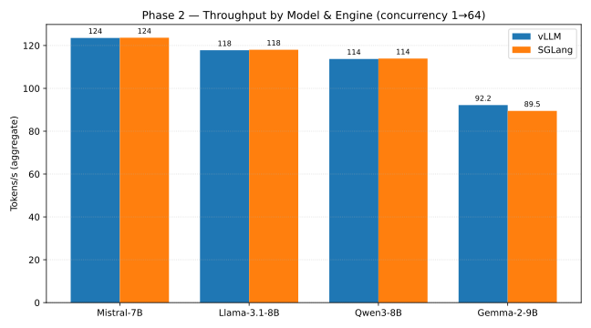
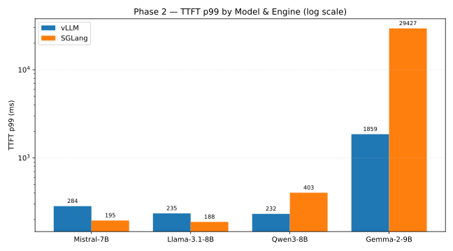
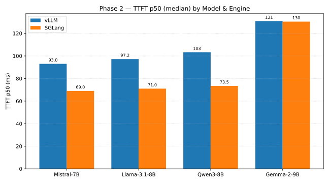
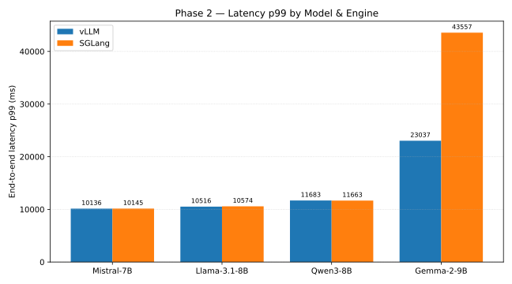

# Phase 2: Concurrency-64 Extended Ramp — Final Summary

Generated 2026-04-18. Single iteration per (model, engine). Concurrency levels {1, 4, 8, 16, 32, 64}, 150 requests/level (900 total). Prompt 128 tokens, output 256 tokens, temperature 0.

**Hardware:** AWS g5.2xlarge, NVIDIA A10G 24 GB, one engine at a time.
**Scenario config:** `throughput_ramp_extended` from `benchmarks/scenarios.py`.

## Results (all 8 cells)

| Model | Engine | Succ | Tokens/s | TTFT p50 (ms) | TTFT p99 (ms) | Latency p50 (ms) | Latency p99 (ms) | Err rate |
|---|---|---:|---:|---:|---:|---:|---:|---:|
| Mistral-7B-Instruct-v0.3          | vllm   | 900/900 | **123.5** |  93.0 |   283.9 |   8686 | 10136 | 0.000 |
| Mistral-7B-Instruct-v0.3          | sglang | 900/900 | **123.6** |  69.0 |   195.1 |   8607 | 10145 | 0.000 |
| Llama-3.1-8B-Instruct             | vllm   | 900/900 | 117.8 |  97.2 |   235.0 |   9078 | 10516 | 0.000 |
| Llama-3.1-8B-Instruct             | sglang | 900/900 | 118.0 |  71.0 |   188.2 |   8993 | 10574 | 0.000 |
| Qwen3-8B                          | vllm   | 900/900 | 113.7 | 103.2 |   232.2 |   9430 | 11683 | 0.000 |
| Qwen3-8B                          | sglang | 900/900 | 113.9 |  73.5 |   403.0 |   9355 | 11663 | 0.000 |
| google/gemma-2-9b-it †            | vllm   | 900/900 |  92.2 | 130.9 |  1859.1 |  11723 | 23037 | 0.000 |
| google/gemma-2-9b-it †            | sglang | 900/900 |  89.5 | 130.4 | 29426.6 |  11631 | 43557 | 0.000 |

† gemma-2-9b-it vLLM requires `--max-model-len 2048 --enforce-eager --gpu-memory-utilization 0.90` to fit the 9 B-parameter KV cache on A10G 24 GB. The default `--max-model-len 8192` fails engine-core initialization. SGLang runs under default flags.

## Charts

| | |
|---|---|
|  |  |
|  |  |

## Key findings

1. **Reliability:** 0 % error rate across all 7 200 requests — A10G 24 GB sustains 7–9 B-class models end-to-end at 128/256 prompt/output with concurrency up to 64.
2. **SGLang wins median TTFT on every model**: p50 TTFT is 23–32 ms lower than vLLM on all four models. Attribute to RadixAttention's trie-based prefix lookup.
3. **vLLM wins tail TTFT on gemma-2-9b-it by ~16×**: p99 TTFT 1.9 s (vLLM) vs 29.4 s (SGLang). SGLang's scheduler exhibits severe tail-latency degradation on gemma-2-9b at concurrency = 64. For latency-SLO serving of gemma-2-9b, vLLM is the safer default.
4. **Throughput parity on 7–8 B models**: vLLM and SGLang differ by ≤ 0.2 tok/s on Mistral-7B, Llama-3.1-8B, and Qwen3-8B. Both engines saturate the A10G decode path equivalently once the KV cache is warm.
5. **9 B throughput drops ~24 %**: gemma-2-9b peaks at ~92 tok/s vs 123 tok/s for Mistral-7B — partly the parameter ratio, partly the forced smaller max-model-len on vLLM.

## Reproduce

```bash
# idempotent — skips cells whose result file already exists
nohup bash scripts/run_new_benchmarks.sh --phase2 \
  > logs/phase2_$(date +%Y%m%dT%H%M%S).log 2>&1 &
```
