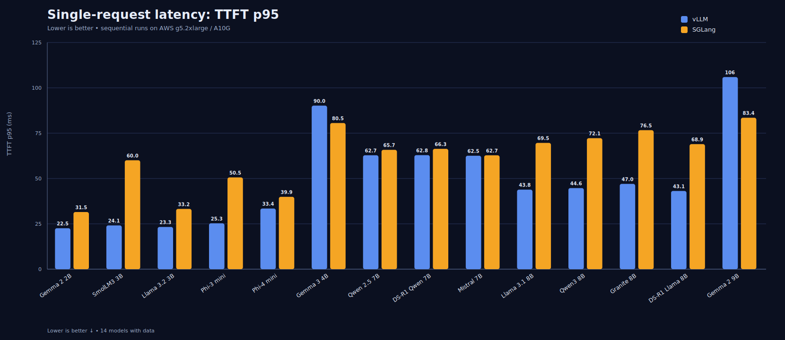
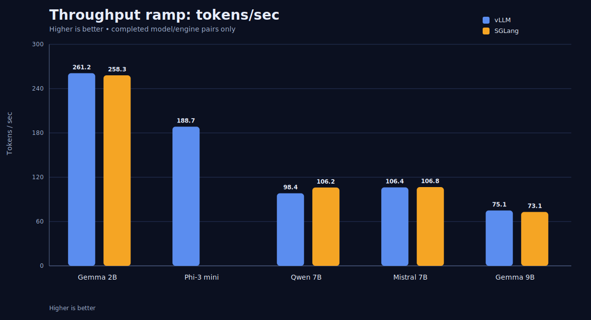
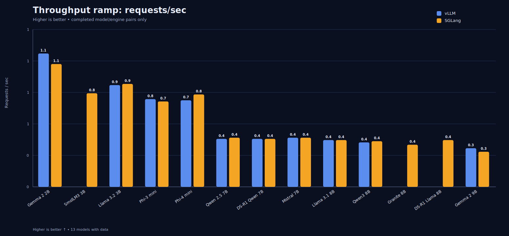
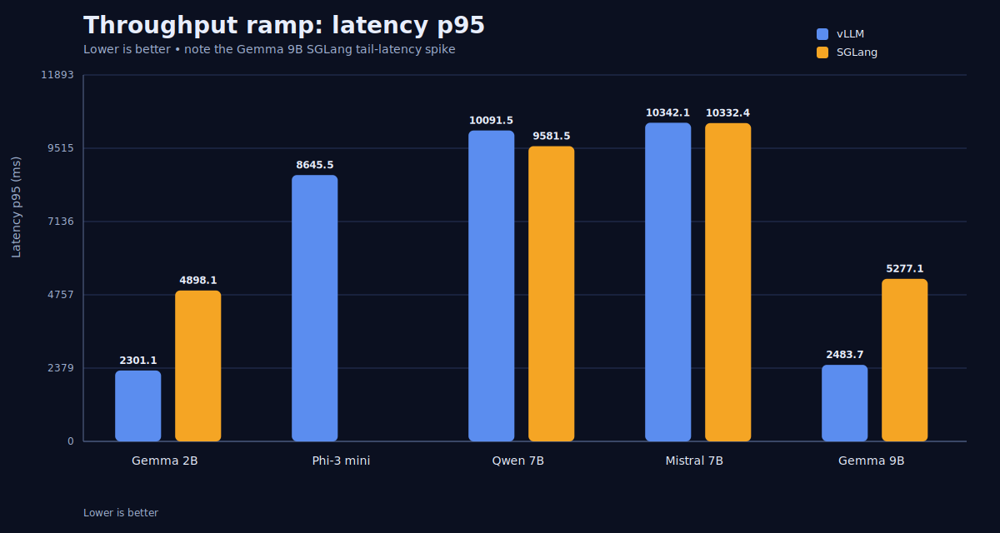
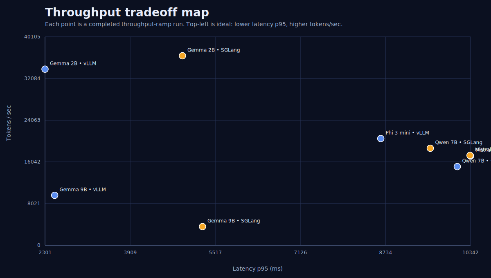

# Final Multi-Model Benchmark Report (2026-03-22)

## Executive summary

This report consolidates the completed benchmark matrix collected on an **AWS g5.2xlarge** host with a single **NVIDIA A10G (24 GB)** GPU. All engine runs were executed **sequentially** on the same machine to avoid VRAM contention and to keep the comparison fair on one GPU.

### Headline findings

- **Fastest single-request TTFT p95:** Gemma 2B on **vLLM** at **20.3 ms**.
- **Highest throughput (tokens/sec):** Gemma 2B on **vLLM** at **261.2 tok/s**.
- **Highest throughput (requests/sec):** Gemma 2B on **vLLM** at **2.23 req/s**.
- **Broad pattern:** vLLM consistently won the low-latency single-request TTFT tests, while throughput leadership depended on the model family.

## Environment

- Instance: **AWS g5.2xlarge**
- GPU: **NVIDIA A10G, 24 GB VRAM**
- Execution policy: **one engine at a time**
- Models included: Gemma 2B, Phi-3 mini, Qwen 7B, Mistral 7B, Gemma 9B

## Important notes

- SGLang could not be included on this setup because the FlashInfer/CUDA graph path failed on unsupported `head_dim=96`.
- vLLM required tuned launch settings on the single A10G: `context=4096` and `gpu_memory_utilization=0.92`.

## Visual summary

### Single-request latency (TTFT p95)

### Throughput tokens/sec

### Throughput requests/sec

### Throughput latency p95

### Throughput tradeoff map

## Single-request latency results

| Model | Scenario | Engine | TTFT p50 | TTFT p95 | Latency p95 | Tok/s | Req/s | Success |
|---|---|---|---:|---:|---:|---:|---:|---:|
| Gemma 2B | `single_request_latency` | vLLM | 19.8 ms | 20.3 ms | 1661.8 ms | 77.6 | 0.61 | 100.0% |
| Gemma 2B | `single_request_latency` | SGLang | 34.1 ms | 35.0 ms | 1683.0 ms | 77.5 | 0.61 | 100.0% |
| Phi-3 mini | `single_request_latency` | vLLM | 25.4 ms | 25.9 ms | 2243.6 ms | 57.8 | 0.45 | 100.0% |
| Qwen 7B | `single_request_latency` | vLLM | 40.4 ms | 40.7 ms | 4202.4 ms | 30.6 | 0.24 | 100.0% |
| Mistral 7B | `single_request_latency` | vLLM | 41.4 ms | 41.7 ms | 4044.0 ms | 31.8 | 0.25 | 100.0% |
| Qwen 7B | `single_request_latency` | SGLang | 67.9 ms | 68.2 ms | 4178.4 ms | 30.9 | 0.24 | 100.0% |
| Mistral 7B | `single_request_latency` | SGLang | 66.0 ms | 66.4 ms | 4057.3 ms | 31.8 | 0.25 | 100.0% |
| Gemma 9B | `single_request_latency` | vLLM | 120.8 ms | 122.2 ms | 381.6 ms | 13.8 | 2.76 | 100.0% |
| Gemma 9B | `single_request_latency` | SGLang | 86.3 ms | 86.9 ms | 333.4 ms | 15.4 | 3.08 | 100.0% |

## Throughput-ramp results

| Model | Scenario | Engine | TTFT p50 | TTFT p95 | Latency p95 | Tok/s | Req/s | Success |
|---|---|---|---:|---:|---:|---:|---:|---:|
| Gemma 2B | `throughput_ramp` | vLLM | 44.0 ms | 189.9 ms | 2301.1 ms | 261.2 | 2.23 | 100.0% |
| Gemma 2B | `throughput_ramp` | SGLang | 53.6 ms | 159.9 ms | 4898.1 ms | 258.3 | 1.01 | 100.0% |
| Phi-3 mini | `throughput_ramp` | vLLM | 55.5 ms | 188.6 ms | 8645.5 ms | 188.7 | 0.74 | 100.0% |
| Qwen 7B | `throughput_ramp` | vLLM | 89.9 ms | 311.9 ms | 10091.5 ms | 98.4 | 0.45 | 100.0% |
| Mistral 7B | `throughput_ramp` | vLLM | 92.3 ms | 240.5 ms | 10342.1 ms | 106.4 | 0.42 | 100.0% |
| Qwen 7B | `throughput_ramp` | SGLang | 68.7 ms | 194.2 ms | 9581.5 ms | 106.2 | 0.41 | 100.0% |
| Mistral 7B | `throughput_ramp` | SGLang | 69.7 ms | 353.6 ms | 10332.4 ms | 106.8 | 0.42 | 100.0% |
| Gemma 9B | `throughput_ramp` | vLLM | 82.7 ms | 362.5 ms | 2483.7 ms | 75.1 | 2.09 | 100.0% |
| Gemma 9B | `throughput_ramp` | SGLang | 91.4 ms | 3666.6 ms | 5277.1 ms | 73.1 | 2.03 | 100.0% |

## Model-by-model takeaways

### Gemma 2B
- vLLM won the single-request TTFT comparison.
- For throughput, vLLM led on both tok/s and req/s.
### Phi-3 mini
- Only vLLM completed the single-request benchmark on this setup.
- Only vLLM completed the throughput ramp on this setup.
- SGLang could not be included on this setup because the FlashInfer/CUDA graph path failed on unsupported `head_dim=96`.
### Qwen 7B
- vLLM won the single-request TTFT comparison.
- For throughput, SGLang led on tok/s while vLLM led on req/s.
### Mistral 7B
- vLLM won the single-request TTFT comparison.
- For throughput, SGLang led on tok/s while vLLM led on req/s.
### Gemma 9B
- SGLang won the single-request TTFT comparison.
- For throughput, vLLM led on both tok/s and req/s.
- vLLM required tuned launch settings on the single A10G: `context=4096` and `gpu_memory_utilization=0.92`.

## Interpretation

This matrix shows why model/engine benchmarking should not be reduced to a single winner. Across this run:

- **vLLM** repeatedly delivered the lowest TTFT in single-request tests.
- **SGLang** remained very competitive and in some cases won or matched throughput on mid-sized models.
- **Larger models** on a single A10G can require engine-specific tuning to fit and behave well.

The data is therefore best used as an **engineering decision aid**, not a blanket statement that one engine dominates all workloads.

## Generated artifacts

- `reports/final_benchmark_report_2026-03-22.md`
- `reports/final_benchmark_report_2026-03-22.html`
- `reports/benchmark_snapshot_2026-03-22.json`
- `reports/figures/single_request_ttft_p95.svg`
- `reports/figures/throughput_tokens_per_sec.svg`
- `reports/figures/throughput_requests_per_sec.svg`
- `reports/figures/throughput_latency_p95.svg`
- `reports/figures/throughput_tradeoff.svg`
